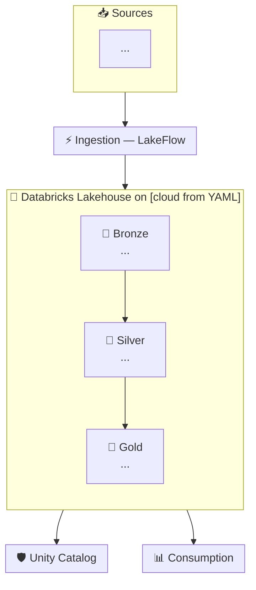

Read the file at `$1` using your file read tool. Parse all fields from the discovery YAML.

Then generate a complete Databricks architecture document and write it to `./live-arch.md`. Structure it exactly as follows:

---

# [customer_name from YAML] — Databricks Lakehouse Architecture
*Generated by Steve Lysik, Databricks SA Candidate | DW Spike*

## Discovery Summary

Create a table summarizing everything known from the YAML:

| Category | Captured | Details |
|----------|----------|---------|

Use ✅ for confirmed facts, ⏳ for partial, ❓ for gaps that need more discovery.

---

## Proposed Architecture

Generate a Mermaid flowchart that shows the full 5-layer Databricks architecture tailored to this customer. Use these rules:

1. **SOURCES subgraph**: One node per source system mentioned in the YAML `sources` field. Label each with system name and size if known.

2. **INGESTION subgraph**: Show the right pattern based on latency requirements:
   - Real-time → Structured Streaming + Kafka/Event Hubs
   - CDC from databases → LakeFlow Connect
   - File-based → Auto Loader
   - Legacy DW migration → Lakebridge + Lakehouse Federation

3. **MEDALLION subgraph** with three inner nodes:
   - Bronze: append-only raw Delta, audit columns
   - Silver: SCD Type 2 (via AUTO CDC), Data Vault if many sources, column masks for PII based on compliance requirements
   - Gold: star schema or OBT, Liquid Clustered on the most-queried fact columns

4. **GOVERNANCE subgraph**: Unity Catalog features appropriate to the compliance requirements in the YAML. Include row filters if GDPR/PCI/Basel, ABAC if multi-jurisdiction.

5. **CONSUMPTION subgraph**: One node per BI tool in `bi_tools`. Add ML model serving if the use case list includes ML/AI.

Use this Mermaid template style:

---

## Architecture Decision Log

For each major architectural choice, create a table row:

| Layer | Decision | Technology Chosen | Why | Trade-off Considered |
|-------|----------|-------------------|-----|----------------------|

Cover at minimum: ingestion pattern, Silver modeling (Data Vault vs. 3NF vs. direct), Gold modeling (star vs. OBT), warehouse type (serverless vs. classic), governance model.

---

## DW Modeling Detail

Based on the modeling preference in the YAML (`modeling_pref`), generate:

**If Star/Dimensional:**
- Proposed fact table names and grain
- Proposed dimension table names
- Suggested Liquid Clustering keys for the primary fact table
- Whether Materialized Views are warranted for any aggregations

**If Data Vault:**
- Hub entity list based on domains in YAML
- Key Link relationships
- Which satellites need `TRACK HISTORY ON`

---

## Performance & Governance Design

Based on query SLAs and compliance from the YAML:
- SQL Warehouse type recommendation (serverless/pro/classic) with rationale
- Liquid Clustering key recommendations
- Predictive Optimization applicability
- Row filter and column mask requirements based on compliance
- ABAC applicability based on number of jurisdictions/regions

---

## Migration Path (If Applicable)

If the YAML mentions a legacy DW migration (`sources` mentions Teradata, Netezza, Redshift, Oracle, etc.):
- Recommended migration strategy (Federation-First vs. Parallel Run vs. Medallion Refactor)
- Lakebridge tooling applicability
- Phasing sequence (which domains first)

---

## Open Discovery Gaps

List the questions Steve still needs to ask to finalize the architecture. Be specific — not "ask about users" but "Ask: Is risk calculation real-time or end-of-day batch? This changes whether we need Structured Streaming in the risk pipeline."

---

## Steve's SA Talking Points for This Customer

Generate 5 bullet points Steve can say out loud during the interview, tailored to this customer's specific context:
- **Lead with:** [strongest Databricks differentiator for this exact situation]
- **DW proof point:** [relevant benchmark or customer story for this use case]
- **Migration angle:** [if applicable — IBM/Netezza personal experience hook]
- **Competitive angle:** [how to handle the most likely competitive pressure given the stack]
- **Risk/governance angle:** [compliance-specific Databricks capability]

---

Write the complete document to `./live-arch.md` using the write tool. Then tell Steve: "✅ Architecture written to live-arch.md — run `bash .pi/skills/databricks-sa/scripts/open-live.sh` to open it in your browser."

If `$1` is empty or the file cannot be read, say: "Please provide the path to a discovery YAML file: `/arch-gen path/to/scenario.yaml`"
