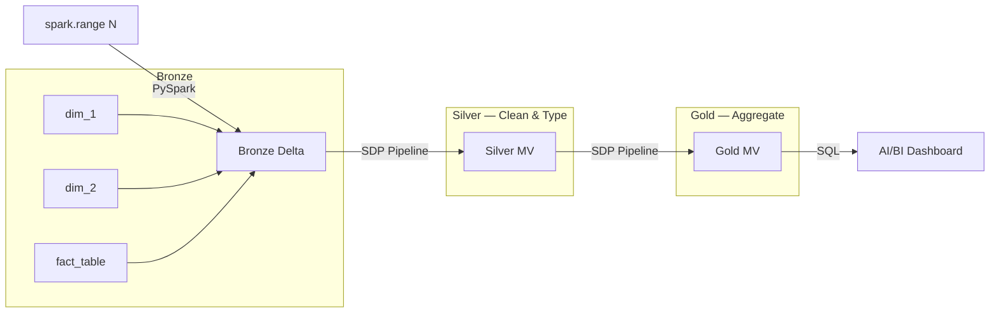
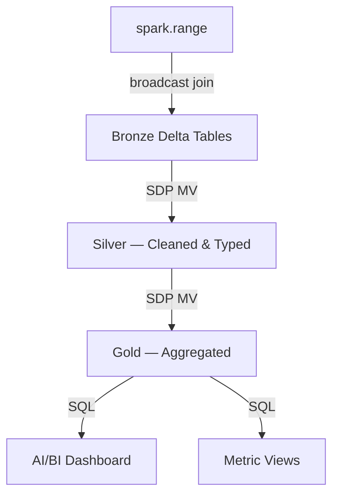

# Repo Best Practices — Interview Project Scaffold

**Priority:** Read this skill FIRST before `spark-native-bronze`. This creates the skeleton; that skill fills it with code.

## When to Use

- **START of every interview** — before writing any code
- When user receives a prompt (retail, media, IoT, SaaS, FinServ — any domain)
- Creates a fresh subdirectory under the main repo with production-quality structure

## Core Principles (Narrate These)

1. **Git repo = source of truth** — all code version-controlled, nothing lives only in workspace
2. **One repo per data product** — tightly coupled code + config in one place
3. **Business logic in `src/`** — notebooks are thin execution wrappers
4. **SQL transformations in `src/pipeline/`** — separate from PySpark generation
5. **Bundle-first** — `databricks.yml` at root, deployable from day one
6. **Tests scaffolded** — even if minimal, the structure exists

## Scaffold Layout

```text
{domain}_lakehouse/
├── databricks.yml                       # flat bundle: pipeline + job + variables
├── README.md                            # project overview + Mermaid architecture
├── .gitignore                           # Python + Databricks + Delta ignores
│
├── src/
│   ├── notebooks/
│   │   └── 01_generate_bronze.py        # PySpark notebook — full inline code
│   └── pipeline/
│       ├── 02_silver_transforms.sql     # raw SQL for SDP (no notebook header)
│       ├── 03_gold_aggregations.sql     # raw SQL for SDP
│       └── 04_validate.sql              # validation queries
│
├── docs/
│   └── architecture.md                  # Mermaid medallion diagram + design notes
│
└── tests/
    └── README.md                        # test scaffold placeholder
```

### Layout Rules

| Rule | Why |
|------|-----|
| Numbered prefixes (`01_`, `02_`, `03_`) | Sort order matches execution order |
| `src/notebooks/` for PySpark notebooks | Bundle `notebook_task` references here |
| `src/pipeline/` for raw SQL | Bundle SDP `file:` references here (NOT `notebook:`) |
| `docs/` for architecture | Interviewer can see design thinking |
| `tests/` scaffolded empty | Shows production mindset |
| Flat `databricks.yml` at root | No split resources — interview speed |
| No `conf/dev/stg/prod/` | Mention in narration, don't build live |

### What Goes Where

| Code Type | Location | Format |
|-----------|----------|--------|
| Bronze data generation (PySpark) | `src/notebooks/01_generate_bronze.py` | Databricks notebook (full inline) |
| Silver transforms (SQL) | `src/pipeline/02_silver_transforms.sql` | Raw SQL — `CREATE OR REFRESH MATERIALIZED VIEW` |
| Gold aggregations (SQL) | `src/pipeline/03_gold_aggregations.sql` | Raw SQL — `CREATE OR REFRESH MATERIALIZED VIEW` |
| Validation queries (SQL) | `src/pipeline/04_validate.sql` | Raw SQL |
| Metric view (if needed) | `src/pipeline/05_metric_view.sql` | Raw SQL — `CREATE METRIC VIEW` |
| Dashboard JSON | `src/dashboard/dashboard.json` | Generated — do NOT hand-edit |
| Bundle config | `databricks.yml` | YAML — pipeline + job + variables |

## File Templates

### README.md Template

````markdown
# {Domain} Lakehouse — Medallion Pipeline

**Catalog:** `{catalog}` | **Schema:** `{schema}` | **Cluster:** interview-cluster

## Architecture



## Layers

| Layer | Tables | Method |
|-------|--------|--------|
| Bronze | `{dim1}`, `{dim2}`, `{fact}` | `spark.range()` → Delta |
| Silver | `silver_{fact}` | SDP Materialized View |
| Gold | `gold_{agg}` | SDP Materialized View |

## Run

```bash
# 1. Deploy bundle
databricks bundle validate && databricks bundle deploy

# 2. Run Bronze notebook on cluster
# 3. Start SDP pipeline (full refresh)
# 4. Open dashboard
```

## Project Structure

```
src/notebooks/   — PySpark Bronze generation (full inline code)
src/pipeline/    — SQL for SDP Silver/Gold (raw SQL, no notebook headers)
docs/            — Architecture diagram and design decisions
tests/           — Test scaffolding
databricks.yml   — Asset Bundle config (pipeline + job)
```
````

### .gitignore Template

```text
# Python
__pycache__/
*.py[cod]
*.egg-info/
dist/
.eggs/

# Databricks
.databricks/
*.whl

# Delta / Spark
spark-warehouse/
metastore_db/
derby.log

# IDE
.idea/
.vscode/
*.swp

# OS
.DS_Store
Thumbs.db

# Secrets — NEVER commit
.env
*.pem
*.key
```

### databricks.yml Template (Flat)

```yaml
bundle:
  name: {domain}_lakehouse

variables:
  catalog:
    default: {catalog}
  schema:
    default: {schema}
  warehouse_id:
    default: {warehouse_id}

targets:
  dev:
    mode: development
    default: true
    workspace:
      host: {workspace_host}

resources:
  pipelines:
    {domain}_medallion:
      name: "{domain}_medallion"
      catalog: ${var.catalog}
      schema: ${var.schema}
      development: true
      serverless: true
      channel: PREVIEW
      libraries:
        - file:
            path: src/pipeline/02_silver_transforms.sql
        - file:
            path: src/pipeline/03_gold_aggregations.sql

  jobs:
    {domain}_orchestrator:
      name: "{domain}_orchestrator"
      tasks:
        - task_key: generate_bronze
          notebook_task:
            notebook_path: src/notebooks/01_generate_bronze.py
        - task_key: run_pipeline
          depends_on:
            - task_key: generate_bronze
          pipeline_task:
            pipeline_id: ${resources.pipelines.{domain}_medallion.id}
            full_refresh: true
```

### docs/architecture.md Template

````markdown
# Architecture — {Domain} Lakehouse

## Design Decisions

1. **spark.range() for data generation** — distributed, no driver pressure, scales linearly
2. **Direct to Bronze Delta** — no intermediate parquet/Volume hop
3. **Broadcast join dims into fact** — dims are tiny, zero shuffle
4. **SDP for Silver/Gold** — declarative SQL, managed compute, auto-optimization
5. **AI/BI Dashboard** — native Databricks BI, no external tool dependency

## Medallion Flow



## Scaling Strategy

| Scale | N_EVENTS | Expected Runtime |
|-------|----------|-----------------|
| Dev | 100 | < 5 sec |
| Demo | 100,000 | < 30 sec |
| Prod | 1,000,000+ | < 2 min |

Zero code changes between scales — only `N_EVENTS` parameter changes.

## What I'd Add in Production

- [ ] Service principal for job ownership (eliminates personal identity auth flakes)
- [ ] CI/CD with `bundle validate` + `bundle deploy` in GitHub Actions
- [ ] Data quality expectations on Silver (SDP `EXPECT` constraints)
- [ ] Monitoring: row count alerts, SLA breach notifications
- [ ] Multi-environment targets: dev → staging → prod
- [ ] Unit tests with chispa for transform functions
````

### tests/README.md Template

```markdown
# Tests

## Planned

- [ ] Unit tests for Bronze generation logic (schema validation, FK integrity)
- [ ] Integration tests for Silver dedup correctness
- [ ] Gold aggregation validation (sum reconciliation Bronze → Gold)

## Run

```bash
pytest tests/ -v
```

In production, these run in CI on every PR before `bundle deploy`.
```

## Scaffold Generation — Execution Steps

When the user provides a domain prompt, execute these steps IN ORDER:

```
1. Determine domain name → set PROJECT_NAME (e.g., retail_lakehouse, media_lakehouse)
2. Create directory: /Users/slysik/databricks/{PROJECT_NAME}/
3. Create subdirs: src/notebooks/, src/pipeline/, docs/, tests/
4. Write README.md from template (fill domain, catalog, schema, table names)
5. Write .gitignore from template
6. Write databricks.yml from template (fill domain, workspace vars)
7. Write docs/architecture.md from template
8. Write tests/README.md from template
9. Print scaffold summary (tree output)
10. THEN read spark-native-bronze/SKILL.md and generate code INTO the scaffold
```

**Total time: ~30 seconds.** Scaffold is ready, code generation starts immediately.

## Domain Adaptation

| User Prompt Mentions | PROJECT_NAME | Dim 1 | Dim 2 | Fact |
|---------------------|--------------|-------|-------|------|
| retail, store, order | `retail_lakehouse` | products | stores | transactions |
| media, stream, content | `media_lakehouse` | content | subscribers | stream_events |
| saas, usage, subscription | `saas_lakehouse` | accounts | features | usage_events |
| iot, sensor, device | `iot_lakehouse` | devices | sensors | readings |
| finserv, banking, finance | `finserv_lakehouse` | accounts | customers | transactions |

Column names and categories adapt per domain. Structure is identical.

## Interview Narration Points (Say While Scaffolding)

1. "I always start with the project structure — makes code reviewable and deployable from the start"
2. "Git repo is the source of truth — everything is version-controlled, nothing lives only in the workspace"
3. "Numbered files match execution order — anyone can follow the pipeline flow"
4. "Bundle config at root — one `databricks bundle deploy` and everything is in the workspace"
5. "In production I'd add dev/staging/prod targets, CI/CD, and service principal auth"
6. "Tests are scaffolded — even for a demo, I want the structure ready for the team to fill in"

## Integration with Other Skills

After scaffold is created, the workflow continues:

```
repo-best-practices (this skill)
    → Creates skeleton + README + bundle YAML
    
spark-native-bronze (next)
    → Generates 01_generate_bronze.py INTO src/notebooks/
    → Generates 02_silver_transforms.sql INTO src/pipeline/
    → Generates 03_gold_aggregations.sql INTO src/pipeline/
    → Generates 04_validate.sql INTO src/pipeline/

sdp-and-dashboard-patterns (if dashboard)
    → Generates dashboard JSON INTO src/dashboard/
    → Updates databricks.yml with dashboard reference

asset-bundles (deploy)
    → bundle validate + bundle deploy from {PROJECT_NAME}/ root
```

## Anti-Patterns — Do NOT Do These

| ❌ Never | ✅ Always |
|----------|----------|
| Code sprawled across random workspace folders | One project directory, numbered files |
| No README, no docs | README with Mermaid diagram from the start |
| Hard-coded catalog/schema in every file | Variables in databricks.yml, config block in notebook |
| SDP SQL with notebook headers | Raw SQL files for `file:` pipeline reference |
| Tests as afterthought | `tests/` directory scaffolded immediately |
| Manual workspace-only code | Git repo → workspace upload |
| `databricks.yml` with inline everything | Flat but organized — one pipeline, one job |

## Definition of Done (Interview Project)

A project is ready to show the interviewer when:

- [ ] Clean directory structure under `{domain}_lakehouse/`
- [ ] README.md with architecture diagram and run instructions
- [ ] databricks.yml validates cleanly (`bundle validate`)
- [ ] Bronze notebook runs and creates Delta tables with correct counts
- [ ] SDP pipeline completes and Silver/Gold MVs have data
- [ ] Dashboard displays charts (if applicable)
- [ ] All code committed to git
- [ ] URLs ready: notebook, pipeline, job, dashboard

## Test Run Learnings (2026-03-11 media_lakehouse)

### What Worked
1. **Scaffold → code gen → deploy took ~2.5 min** — fast enough to do live while narrating.
2. **`databricks.yml` flat config validated and deployed first try** — no YAML issues.
3. **`src/notebooks/` + `src/pipeline/` separation is clean** — bundle references work, interviewer sees logical structure.
4. **README.md with Mermaid renders nicely in GitHub** — also readable in workspace if pushed via Git folder.

### What to Watch
5. **Bundle deploys to `.bundle/media_lakehouse/dev/files/` in workspace** — this is the execution path. The visible `/Users/slysik@gmail.com/media_lakehouse/` folder is a separate upload for the interviewer to browse. Both are needed.
6. **`src/dashboard/dashboard.json`** is generated code — don't include in `workspace import`. Deploy via REST API only.
7. **Numbered files (01_, 02_, 03_, 04_) sort correctly in workspace folder** — confirmed in UI.
8. **`docs/architecture.md` and `tests/README.md` stay local in git** — don't upload to workspace. They're for the repo reviewer, not the Databricks UI.

### Timing (all constant regardless of data scale)
| Step | Time |
|------|------|
| Create dirs + write scaffold files | ~30 sec |
| Write notebook + SQL + dashboard JSON | ~1.5 min |
| `bundle validate` | ~4 sec |
| `bundle deploy` | ~20 sec |
| Upload notebooks to workspace | ~10 sec |
| **Scaffold + deploy subtotal** | **~2.5 min** |

## Reference

Full repo best practices document (22 sections, production-grade):
- [databricks_repo_best_practices_skill.md](../../databricks_repo_best_practices_skill.md)

This skill is the **interview-speed extract**. The full doc covers CI/CD flows, branching, secrets management, environment promotion — topics to **narrate** during the interview but not build live.
