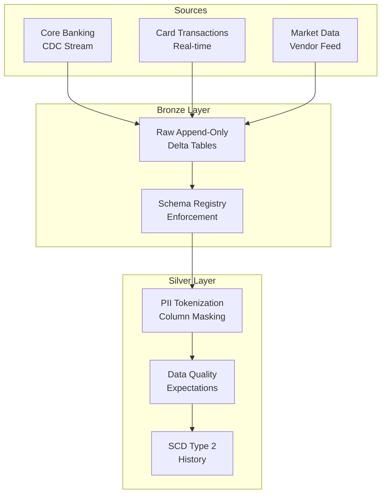
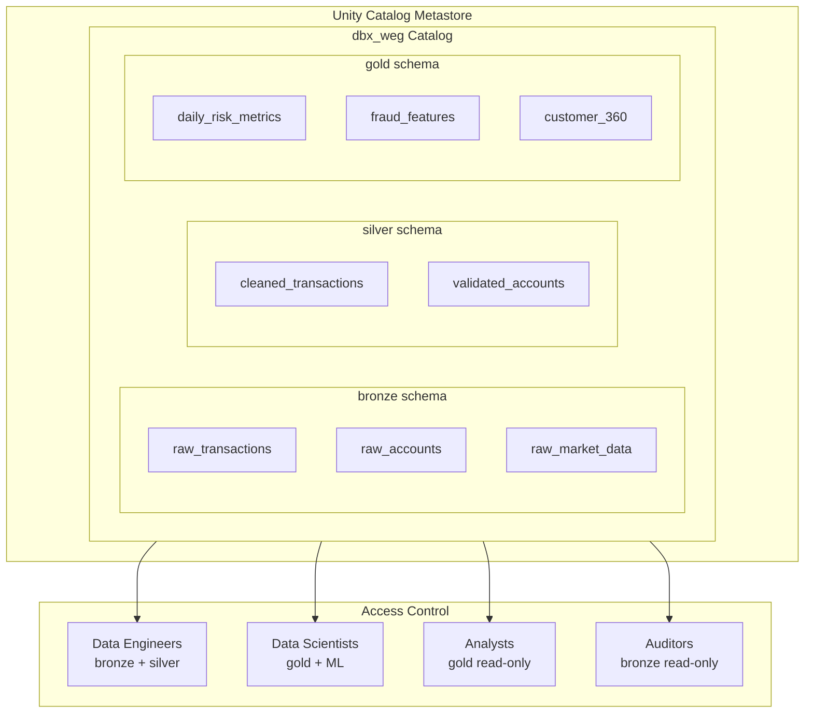
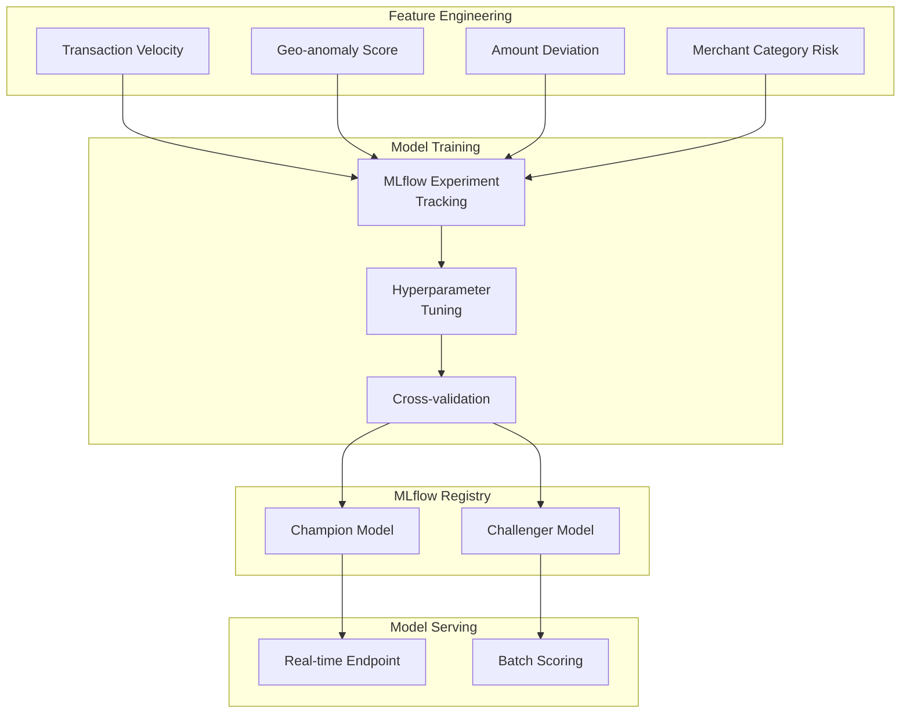

# Databricks SA — Design & Architecture

**Financial Services Vertical**

SteveLysik | SA Candidate

  
    Press Space for next slide <carbon:arrow-right class="inline"/>
  

<!--
Opening slide. Set the stage: FinServ focus, DW migration expertise (8 years IBM/Netezza).
Key message: I bring deep data warehousing DNA to the Databricks platform.
-->

---
transition: fade-out
---

# Medallion Architecture — FinServ ETL Pipeline

<MedallionPipeline
  title="FinServ ETL Pipeline - Medallion Architecture"
  subtitle="Databricks Lakehouse | Unity Catalog | Serverless"
  :sources="['Card Networks', 'POS Terminals', 'Foo','Mobile Wallets']"
  :bronze="{
    label: 'BRONZE',
    desc: 'Raw Streaming Ingestion',
    stats: 'transactions',
    bullets: [
      'ACID / exactly-once',
      'Partitioned by date',
      'Immutable audit trail',
      'Time travel enabled'
    ]
  }"
  :silver="{
    label: 'SILVER',
    desc: 'Cleanse / Validate / Mask',
    stats: '45,244 transactions',
    bullets: [
      'PII masked (PCI-DSS)',
      'DQ validation + quarantine',
      'Risk score enrichment',
      'MERGE INTO (upserts)'
    ]
  }"
  :gold="{
    label: 'GOLD',
    desc: 'Aggregates + ML Features',
    bullets: [
      'cardholder_features (10)',
      'merchant_risk (500)',
      'hourly_volume (20)',
      '22+ ML features/user',
      'Z-ORDER optimized'
    ]
  }"
  :ml="{
    label: 'MLflow',
    desc: 'Fraud Detection Model',
    bullets: [
      'GradientBoosting',
      'RandomForest',
      'Experiment tracking',
      'Model comparison',
      'Batch inference > Delta'
    ]
  }"
  governance="Unity Catalog — Governance | Lineage | RBAC | Column Masks | Audit"
  :serving="['Power BI / Genie AI', 'DBSQL Dashboards', 'Fraud Predictions']"
  :serverlessFixes="[
    'availableNow trigger',
    'UC Volume checkpoints',
    'tableExists() not isDelta',
    'Class balance fix',
    'MLflow registry fallback',
    'Missing F import'
  ]"
/>

<!--
Walk through the medallion architecture:
- Bronze: Raw streaming ingest (availableNow=True for serverless)
- Silver: PII masking, data validation, SCD Type 2
- Gold: Business aggregations, feature engineering
- ML: MLflow fraud detection model → model registry → serving

Key callout: This isn't just theory — I've built this end-to-end in my demo workspace.
Catalog: dbx_weg with bronze/silver/gold schemas.
-->

---

# Lakehouse Architecture — Full Stack View

<Excalidraw drawFilePath="finserv-architecture.excalidraw" class="w-full h-[420px]" :darkMode="false" />

<!--
Detailed component view:
- Unity Catalog governance layer
- Spark Structured Streaming for real-time ingest
- Delta Lake ACID transactions
- MLflow experiment tracking + model registry
- Serverless compute (SQL warehouses + jobs)

Emphasize: Single source of truth across analytics, ML, and governance.
-->

---

# Architecture Whiteboard

<Excalidraw drawFilePath="architecture-whiteboard.excalidraw" class="w-full h-[420px]" :darkMode="false" />

<!--
General-purpose architecture whiteboard.
Use this as a base to draw additional components during discussion.
Can annotate live with the drawing toolbar.
-->

---
layout: two-cols
layoutClass: gap-16
---

# Streaming Pipeline Design

::right::

## Key Design Decisions

<v-clicks>

- **availableNow=True** over processingTime (serverless-compatible)
- **Delta Lake checkpoints** in Unity Catalog Volumes
- **Schema enforcement** at Bronze boundary
- **Column-level masking** for PII in Silver
- **Expectations** for data quality gates

</v-clicks>

<!--
Streaming design rationale:
- availableNow=True: processes all available data then stops. Works with serverless jobs.
- Checkpoints in UC Volumes: portable, governed, not tied to DBFS.
- Schema enforcement early: fail fast on bad data.
- PII masking in Silver: Bronze keeps raw for audit/replay.
-->

---

# Unity Catalog Governance Model

<!--
Unity Catalog 3-level namespace: catalog.schema.table
- Role-based access: engineers get bronze/silver, scientists get gold + ML
- Auditors get read-only bronze (raw data for compliance)
- Column-level masking + row-level security available
- Data lineage tracked automatically across the pipeline
-->

---

# Teradata → Databricks Migration

<Excalidraw drawFilePath="teradata-migration-pitfalls.excalidraw" class="w-full h-[420px]" :darkMode="false" />

<!--
The 4 Silent Killers from my Teradata migration research:
1. PK/Uniqueness — Teradata enforces, Delta doesn't → use MERGE + AUTO CDC
2. Duplicate Rejection — SET tables silently dedup → add explicit dedup logic
3. Collation — Teradata case-insensitive by default → COLLATE UTF8_LCASE
4. DECIMAL Precision — double CAST pattern to avoid silent truncation

This is where my 8 years of DW experience (IBM/Netezza) becomes the differentiator.
I've lived through these exact migration pain points.
-->

---
layout: two-cols
layoutClass: gap-16
---

# Fraud Detection ML Pipeline

::right::

## MLflow Integration

<v-clicks>

- **Experiment**: `/Users/slysik@gmail.com/finserv-fraud-detection`
- **Champion/Challenger** pattern for safe deployments
- **Feature Store** integration with gold layer tables
- **Real-time serving** for transaction scoring
- **Batch scoring** for overnight risk reports
- **A/B testing** via traffic splitting on endpoints

</v-clicks>

<!--
ML pipeline connects directly to gold layer:
- Features computed in Gold schema (fraud_features table)
- MLflow tracks all experiments, parameters, metrics
- Model Registry manages promotion: None → Staging → Production
- Serving endpoint for real-time fraud scoring on new transactions
- Latency target: <100ms p99 for real-time scoring
-->

---
layout: center
class: text-center
---

# Live Whiteboard

  Click the pen icon in the toolbar to draw

  Draw your architecture here

<!--
Blank canvas for ad-hoc whiteboarding during the interview.
Use the built-in drawing tools to sketch architecture on the fly.
Drawings persist — you can come back to this slide.

Good for:
- Answering "how would you design X?" questions
- Sketching alternative approaches
- Diagramming data flows for specific scenarios
-->

---
layout: center
class: text-center
---

# Live Whiteboard — Scenario 2

  Second blank canvas for additional scenarios

  Draw your architecture here

<!--
Second whiteboard slide for a different scenario question.
Keep slides separate so you can reference both drawings later.
-->

---
layout: end
---

# Thank You

Steve Lysik — Databricks Solutions Architect

  8 years data warehousing (IBM/Netezza) → Databricks Lakehouse

