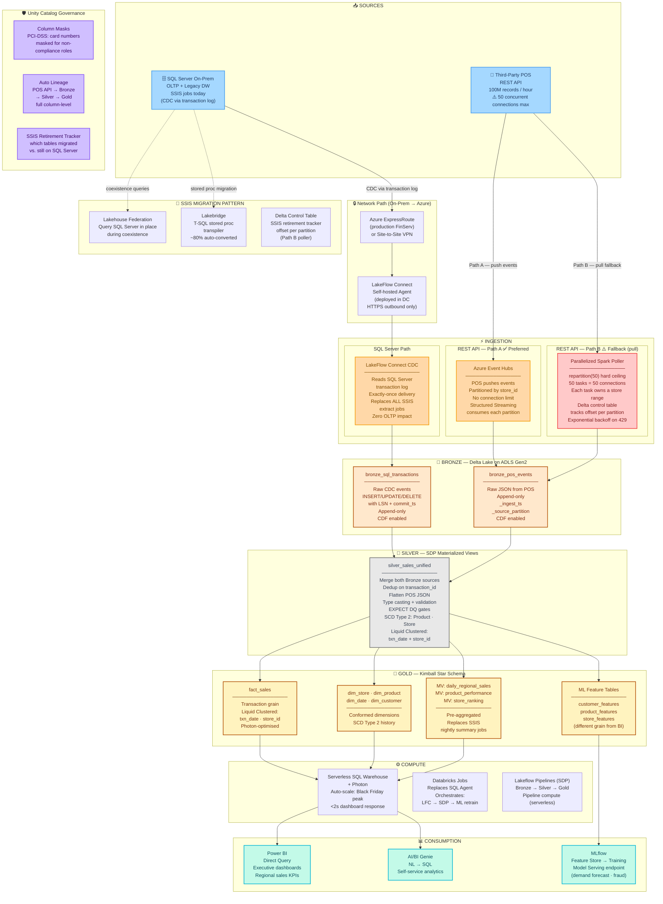

# Retail Client — Global Sales Platform | Databricks SA Interview
*Last updated: 2026-03-02 | Interviewer: Steve Lysik*

## Discovery Status
| Category | Status | Key Facts |
|----------|--------|-----------|
| Business Problem | ✅ | Replace SQL Server on-prem + SSIS. Ingest POS REST API at 100M records/hr. |
| Current Stack | ✅ | SQL Server on-prem (OLTP/DW) + SSIS jobs + Third-party POS REST API |
| Cloud & Region | ⏳ | Assuming Azure — confirm region for data residency |
| Data Volume | ✅ | 100M records/hour from POS REST API. SQL Server volume TBD. |
| API Constraint | ✅ | 50 concurrent connections max → Spark parallelism = exactly 50 |
| Latency Needs | ⏳ | Assuming near-real-time BI (<15 min). Confirm. |
| Compliance | ⏳ | PCI-DSS assumed (POS = card data). Confirm GDPR for EU stores. |
| Consumers | ✅ | High-performance BI reporting + ML models |

---

## Proposed Architecture

---

## Key Architecture Decisions

| Decision | Choice | Rationale | Trade-off |
|----------|--------|-----------|-----------|
| **SQL Server ingestion** | LakeFlow Connect CDC | Reads transaction log — no OLTP impact, sub-minute latency, replaces all SSIS extract jobs | Requires CDC enabled on SQL Server + network path |
| **Network path** | ExpressRoute + self-hosted agent | Private connectivity — no data on public internet (PCI-DSS) | ExpressRoute provisioning lead time — start this conversation day 1 |
| **REST API — Path A** | Event Hubs → Structured Streaming | Push-based — no connection limit problem, partitioned by store_id, exactly-once | Requires POS vendor cooperation |
| **REST API — Path B** | Parallelized Spark poller | `repartition(50)` = exactly 50 connections, Delta control table tracks offsets per partition | Complex ops, vendor SLA dependent, misses deletes |
| **Silver merge** | Unified silver_sales from both sources | Single clean table downstream — BI and ML don't care which system the record came from | Dedup complexity at Silver — worth it |
| **Gold for BI** | Kimball Star + Materialized Views | BI tools optimized for star schema. MVs replace SSIS nightly summary jobs. | MV recompute cost — offset by eliminating batch window |
| **Gold for ML** | Separate feature tables | ML needs customer/product grain, not transaction grain. Isolates ML from BI schema changes. | Dual Gold maintenance |
| **SSIS retirement** | Phased — extract first, transform second | Never big-bang. LFC replaces extract immediately. SDP replaces transforms as validated. | Coexistence period adds dual-run cost |

## Open Questions
- [ ] Is SQL Server CDC enabled today? If not — can the DBA enable it?
- [ ] Can POS vendor push to Event Hubs? (determines Path A vs B)
- [ ] What's the API page size? (affects Path B math — need ≥1,000 records/call)
- [ ] Historical backfill required? How many years?
- [ ] How many SQL Server tables in scope for migration?
- [ ] GDPR in scope for EU store data?

## SSIS Retirement Map
| SSIS Component | Databricks Replacement | When |
|---|---|---|
| Extract jobs (SQL Server → staging) | LakeFlow Connect CDC | Phase 1 — immediate |
| Transform data flows | SDP Silver MV | Phase 1 — parallel run |
| Aggregate/load to DW | SDP Gold MV | Phase 2 — after Silver validated |
| SQL Agent schedules | Databricks Jobs | Phase 2 — cutover |
| T-SQL stored procedures | Lakebridge transpiler | Phase 3 — decommission |

## Steve's Talking Points
- **Lead with:** "Two sources, two ingestion patterns, one Bronze layer, one unified Silver. The architecture doesn't care where the record came from by the time it hits Silver."
- **On SSIS:** "SSIS fails silently. LakeFlow Connect emits health metrics to Azure Monitor natively — lag, throughput, connection status. You go from finding out at report time to finding out in real time."
- **On 50 connections:** "50 concurrent connections doesn't break the architecture — it defines the Spark parallelism. `repartition(50)` and a Delta control table is all you need."
- **Watch out for:** Jumping to Auto Loader before addressing the network path from on-prem SQL Server. That's the first blocker in every real migration.
