# Databricks Intelligent Data Warehousing — Reference Architecture
*Template · Fill in customer details during discovery · Steve Lysik SA Interview Prep*

---

## Architecture Overview

```mermaid
flowchart LR

    subgraph S1["① DATA SOURCES\nOn-Prem or Cloud"]
        direction TB
        src1["🗄️ Data Warehouses\n[customer EDW]"]
        src2["🏢 On-Premises Systems\n[core banking / ERP]"]
        src3["☁️ SaaS Applications\n[CRM / Salesforce / SAP]"]
        src4["📋 Machine & App Logs\n[events / telemetry]"]
        src5["⚡ Application Events\n[Kafka / Event Hubs]"]
        src6["📱 Mobile & IoT Data\n[devices / sensors]"]
    end

    subgraph PLATFORM["🔶  DATA INTELLIGENCE PLATFORM"]
        direction TB

        ORCH["━━━━━━━━━━━━━━  ORCHESTRATION  ━━━━━━━━━━━━━━\nDatabricks Workflows · Jobs · Dependency management · Error handling"]

        subgraph S2["② INGESTION"]
            direction TB
            batch["⏱️ Batch Ingestion\nAuto Loader · JDBC\nScheduled"]
            cdc["🔄 CDC Ingestion\nLakeFlow Connect\nChange streams"]
            stream["🌊 Streaming Ingestion\nStructured Streaming\nKafka / Event Hubs"]
        end

        subgraph S34["③ MEDALLION STORAGE  ←→  ④ DATA ENGINEERING + AI/ML"]
            direction LR

            subgraph MEDAL["③ RAW → ODS → DIMENSIONS / FACTS → DATAMARTS"]
                raw["🥉 RAW\nDelta · Append-only\nSource as-is\n[customer sources]"]
                ods["🥈 ODS\nStandardised\nDQ + PII masked\n[customer transforms]"]
                dims["🥇 Dimensions\nLiquid Clustered\nSCD Type 2\n[customer dims]"]
                facts["🥇 Facts\nLiquid Clustered\nPhoton-optimised\n[customer facts]"]
                dmarts["📊 Datamarts\nMaterialized Views\nBusiness aggregates\n[customer marts]"]
                raw -->|"Cleanse\n+ Validate"| ods
                ods -->|"Apply business\nlogic"| dims
                ods -->|"Apply business\nlogic"| facts
                dims -->|"Aggregate\n+ curate"| dmarts
                facts -->|"Aggregate\n+ curate"| dmarts
            end

            subgraph AIML["④ DATA ENGINEERING + AI/ML"]
                de["🔧 Data Engineering\nSpark Declarative Pipelines\nDeclarative ETL · Schema evolution\nBuilt-in lineage + observability"]
                ml["🤖 AI / ML\nMLflow · Model Registry\nDemand forecasting · Anomaly\nCustomer scoring · SAR triage"]
            end

            MEDAL <-->|"Model outputs\nback to warehouse"| AIML
        end

        subgraph SERVE["⑤⑥⑦⑧ SERVE + CONSUME"]
            direction TB
            s5["⑤ Query\nDatabricks SQL\nServerless compute\nHigh-concurrency · Photon"]
            s6["⑥ Dashboards\nAI/BI · Power BI · Tableau\nNL → chart · Point-and-click\nSecure sharing"]
            s7["⑦ Serve\nDelta Sharing\nDownstream apps\nNotebooks · APIs"]
            s8["⑧ Natural Language Query\nGenie Space · NL → SQL\nSelf-service · No SQL needed\nAdapts to business terminology"]
        end

        subgraph FOUND["UNIFIED · OPEN · SCALABLE LAKEHOUSE ARCHITECTURE"]
            direction LR
            gov["🛡️ GOVERNANCE\nUnity Catalog\nAccess control · Lineage\nAuditing · Classification\n[customer compliance]"]
            store["📦 OPEN STORAGE\nDelta Lake · Parquet · Iceberg\nVendor-neutral · Portable\nLong-term durability"]
        end

        ORCH --> S2
        S2 --> S34
        S34 --> SERVE
    end

    subgraph OUT["CONSUMERS"]
        direction TB
        out1["🖥️ External Apps\n[customer apps]"]
        out2["🗄️ Operational Databases\n[Lakebase / downstream]"]
        out3["🤝 Data Sharing\n[Delta Sharing / ECB / FRB]"]
        out4["👤 Business Users\n[analysts / compliance]"]
        out5["📊 BI Reporting\nTableau · Power BI · Excel"]
    end

    S1 --> S2
    SERVE --> OUT
    FOUND -.->|"Governs\neverything"| PLATFORM
```



---

## Step-by-Step Reference

| # | Step | Databricks Technology | Key Differentiator |
|---|------|-----------------------|--------------------|
| ① | **Data Sources** | Any source — on-prem, cloud, SaaS, streaming | Unified ingestion for all modalities |
| ② | **Ingestion** | LakeFlow Connect (CDC) · Auto Loader (files) · Structured Streaming | No separate infra per modality; schema evolution auto |
| ③ | **Medallion Storage** | Delta Lake · RAW → ODS → Dims/Facts → Datamarts | Declarative pipelines · lineage · Liquid Clustering |
| ④ | **Data Engineering + AI/ML** | Spark Declarative Pipelines · MLflow · Model Registry | Colocated analytics + AI — no data movement |
| ⑤ | **Query** | Databricks SQL · Serverless · Photon | Direct query — no replication · IWM auto-scale |
| ⑥ | **Dashboards** | AI/BI Dashboards · Power BI · Tableau DirectQuery | NL → chart · AI-assisted · governed real-time data |
| ⑦ | **Serve** | Delta Sharing · Lakebase · Notebooks · APIs | Zero-copy sharing · regulatory submission ready |
| ⑧ | **NLQ / Genie** | Genie Space · Unity Catalog semantics | NL → SQL · adapts to business terminology · auditable |
| ⚙️ | **Orchestration** | Databricks Workflows · Jobs | Batch + streaming + AI in one orchestration layer |
| 🛡️ | **Governance** | Unity Catalog · Row filters · Column masks · ABAC | Single plane across all assets, clouds, workloads |
| 📦 | **Open Storage** | Delta Lake · Parquet · Iceberg | Vendor-neutral · interoperable · no lock-in |

---

## Discovery Overlay — Fill In During Session

```
CUSTOMER:        [NAME]
CLOUD:           [Azure / AWS / GCP]
COMPLIANCE:      [GDPR · PCI-DSS · Basel IV · OCC · BSA/AML · SOX]
URGENCY:         [Timeline / deadline]

SOURCES (① box):
  - [Source 1: type + system name]
  - [Source 2]  ...

INGESTION (② box):
  - LakeFlow Connect → [which sources]
  - Auto Loader       → [which file sources]
  - Structured Stream → [which event sources]

MEDALLION (③ box):
  RAW:      [volume · retention period]
  ODS:      [key transforms · PII fields masked]
  Dims:     [key dimensions]
  Facts:    [key fact tables · Liquid Cluster keys]
  Datamarts:[named marts for consumption]

AI/ML (④ box):
  - [Model 1: use case]
  - [Model 2: use case]

CONSUMPTION (⑤–⑧ boxes):
  Query:      [user count · SLA]
  Dashboards: [BI tool · report count]
  Serve:      [Delta Sharing targets]
  NLQ:        [Genie Space topics]

GOVERNANCE (bottom):
  Unity Catalog: [row filters · column masks · compliance tags]
  Compliance:    [specific regulatory requirements]
```

---
*Generated by Steve Lysik SA Interview Copilot · Databricks Design & Architecture Interview Prep*
