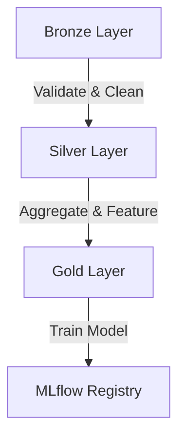
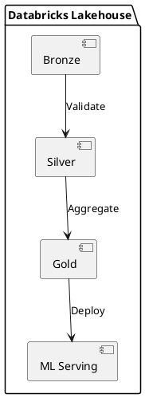
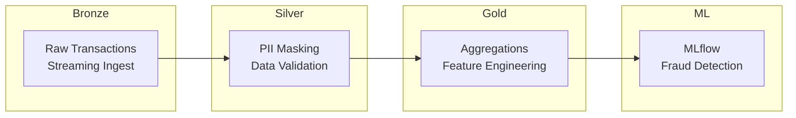
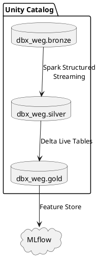

# Slidev (sli.dev) -- Markdown Presentation Framework Research

## Research Task
Investigate Slidev's practical setup, diagram capabilities (Mermaid, PlantUML, Excalidraw, embedded SVGs, custom Vue components), drawing/whiteboard features, presenter mode, and export options. Focus on using it for Databricks architecture diagrams during a technical interview.

## Summary

Slidev is a developer-focused, Markdown-based presentation framework built on Vue.js and Vite. It has **native built-in support** for Mermaid diagrams, PlantUML diagrams, freehand drawing/annotations, and custom Vue components -- making it exceptionally well-suited for creating and presenting architecture diagrams live. Excalidraw integration is available via a third-party addon or a custom Vue component. Presenter mode includes speaker notes, a configurable timer, drawing tools, and real-time sync. Export supports PDF, PNG, PPTX, and Markdown.

## Detailed Findings

### 1. Installation and Getting Started

**Prerequisites**: Node.js >= 18.0<sup>[1](#sources)</sup>

| Package Manager | Command |
|----------------|---------|
| bun | `bun create slidev` |
| npm | `npm init slidev@latest` |
| pnpm (recommended) | `pnpm create slidev` |
| yarn | `yarn create slidev` |

**Standalone single-file usage** (no project scaffold needed)<sup>[1](#sources)</sup>:
```bash
bun add -g @slidev/cli
slidev slides.md
```

**Project structure** after creation<sup>[1](#sources)</sup>:
```
your-slidev/
  slides.md           # All slide content (Markdown)
  components/          # Custom Vue components (auto-imported)
  public/              # Static assets (images, excalidraw files)
  package.json
```

**Dev server**: `slidev --open` or add to package.json scripts and run `bun run dev`<sup>[1](#sources)</sup>

**Slide separation**: Slides are divided by `---` on its own line with blank lines before/after<sup>[2](#sources)</sup>

**Presenter notes**: Comment blocks at the end of each slide become speaker notes<sup>[2](#sources)</sup>:
```markdown
---

# Slide Title

Content here

<!--
Speaker notes go here.
Markdown and HTML are supported in notes.
-->
```

---

### 2. Diagram Support

#### Mermaid Diagrams (Built-in)

Native support -- no plugins needed. Use a fenced code block with `mermaid` language<sup>[3](#sources)</sup>:

````markdown

````

**Customization options**<sup>[3](#sources)</sup>:
- `theme`: Visual styling (e.g., `'neutral'`, `'dark'`, `'forest'`)
- `scale`: Diagram size (numeric, e.g., `0.8`)
- Full Mermaid syntax supported: flowcharts, sequence diagrams, class diagrams, state diagrams, ER diagrams, Gantt charts, etc.

#### PlantUML (Built-in)

Also native -- use a `plantuml` code block<sup>[4](#sources)</sup>:

````markdown

````

**Configuration**: By default, source is sent to `https://www.plantuml.com/plantuml` for rendering. You can configure a self-hosted server via frontmatter<sup>[4](#sources)</sup>:
```yaml
---
plantUmlServer: https://your-server.com/plantuml
---
```

#### Excalidraw Integration (Addon)

**Option A -- Addon** (`slidev-addon-excalidraw`)<sup>[5](#sources)</sup>:
```bash
bun add slidev-addon-excalidraw
```
Register in frontmatter:
```yaml
---
addons:
  - slidev-addon-excalidraw
---
```
Use in slides:
```html
<Excalidraw
  drawFilePath="./architecture.excalidraw.json"
  class="w-[600px]"
  :darkMode="false"
  :background="false"
/>
```
Note: The `.excalidraw.json` file must be in the `public/` directory<sup>[5](#sources)</sup>.

**Option B -- Custom Vue Component** (for more control)<sup>[6](#sources)</sup>:
Create `components/ExcalidrawSvg.vue` using `@excalidraw/utils` `exportToSvg()` function. This approach supports dark mode color inversion and custom styling.

#### Embedded SVGs and Images

SVGs and images can be embedded directly in Markdown or via HTML<sup>[2](#sources)</sup>:
```markdown


<!-- Or with HTML for sizing control -->

```

#### Custom Vue Components for Diagrams

Create any `.vue` file in `components/` -- it is auto-imported and usable in slides without any import statement<sup>[7](#sources)</sup>:
```
components/
  ArchitectureDiagram.vue
  DataFlowChart.vue
```
Then in your slide:
```markdown
# Data Architecture

<ArchitectureDiagram :layers="['bronze','silver','gold']" />
```

---

### 3. Drawing and Whiteboard Features

Slidev has **built-in freehand drawing and annotation** powered by the `drauu` library<sup>[8](#sources)</sup>:

- Click the drawing icon in the navigation bar to activate
- Available in both presentation mode and presenter mode
- Drawings sync in real-time across all connected browser instances
- **Stylus support**: On iPad with Apple Pencil, Slidev auto-detects input type -- pen draws while fingers navigate<sup>[8](#sources)</sup>

**Persistence**: Drawings can be saved as SVGs and included in exports<sup>[8](#sources)</sup>:
```yaml
---
drawings:
  persist: true          # Save drawings to .slidev/drawings/
  presenterOnly: true    # Only presenter can draw
  syncAll: true          # Sync across all instances
  enabled: true          # or 'dev' for dev-only, false to disable
---
```

---

### 4. Presenter Mode

**Access**: Click the presenter button in the nav bar, or go to `http://localhost:<port>/presenter`<sup>[9](#sources)</sup>

**Recommended setup**: Open two browser windows -- one in play mode (share with audience), one in presenter mode (for yourself)<sup>[9](#sources)</sup>

**Features**<sup>[9](#sources)</sup><sup>[10](#sources)</sup>:

| Feature | Details |
|---------|---------|
| Speaker Notes | Rendered from comment blocks in each slide; supports Markdown/HTML |
| Batch Notes Editor | Available at `http://localhost:<port>/notes-edit` for editing all notes at once |
| Timer | Stopwatch (counts up) or countdown mode; configurable duration (default 30min) |
| Progress Bar | Visual progress indicator in presenter view |
| Next Slide Preview | See upcoming slide while presenting |
| Three Layouts | Cycle through different presenter view arrangements |
| Drawing Tools | Full drawing/annotation available during presentation |
| Screen Mirror | Capture and display another monitor/window in presenter view |
| Real-time Sync | All connected instances follow the presenter's navigation |

**Timer configuration**<sup>[10](#sources)</sup>:
```yaml
---
duration: 45min
timer: countdown    # or 'stopwatch' (default)
---
```

---

### 5. Export Options

**Dependency required**<sup>[11](#sources)</sup>:
```bash
bun add -D playwright-chromium
```

**Export commands**<sup>[11](#sources)</sup>:

| Format | Command | Output |
|--------|---------|--------|
| PDF | `slidev export` | `./slides-export.pdf` |
| PNG | `slidev export --format png` | Individual PNGs per slide |
| PPTX | `slidev export --format pptx` | PowerPoint (slides as images + notes) |
| Markdown | `slidev export --format md` | Markdown with embedded PNGs |

**Key options**<sup>[11](#sources)</sup>:

| Option | Purpose |
|--------|---------|
| `--with-clicks` | Export each animation step as a separate page |
| `--output <name>` | Custom output filename |
| `--range 1,4-5,6` | Export specific slides only |
| `--dark` | Export in dark theme |
| `--timeout 60000` | Increase rendering timeout |
| `--with-toc` | Generate PDF outline/bookmarks |
| `--per-slide` | One PDF page per slide (better for global components) |

**Browser-based export**: Visit `http://localhost:<port>/export` for a UI-based export without CLI<sup>[11](#sources)</sup>

---

### 6. Additional Relevant Features

- **Monaco Editor**: Embed live, editable code blocks (VS Code editor in slides)<sup>[12](#sources)</sup>
- **Shiki Magic Move**: Animated code transitions between states<sup>[12](#sources)</sup>
- **LaTeX/KaTeX**: Mathematical equations<sup>[12](#sources)</sup>
- **Draggable Elements**: Move objects during presentation<sup>[12](#sources)</sup>
- **Recording**: Built-in screen/presentation recording<sup>[12](#sources)</sup>
- **Remote Access**: Share a URL for remote viewers<sup>[12](#sources)</sup>
- **Rough Marker**: Hand-drawn annotation style for a whiteboard aesthetic<sup>[12](#sources)</sup>
- **VS Code Extension**: Edit slides with IDE support<sup>[12](#sources)</sup>

---

## Quick-Start Recipe for Architecture Diagrams

```bash
# Create project
bun create slidev my-interview-deck
cd my-interview-deck

# Add Excalidraw support (optional)
bun add slidev-addon-excalidraw

# Add export support
bun add -D playwright-chromium

# Start dev server
bun run dev
```

**Minimal `slides.md` with architecture diagram**:

```markdown
---
theme: default
addons:
  - slidev-addon-excalidraw
drawings:
  persist: true
  presenterOnly: true
duration: 45min
timer: countdown
---

# Databricks Lakehouse Architecture



<!--
Notes: Walk through the medallion architecture.
Bronze = raw append-only, Silver = cleaned/validated,
Gold = business-ready aggregations, ML = model training & serving.
-->

---

# Detailed Component View



---

# Live Architecture Drawing

Use the drawing toolbar to sketch additional components live.

<v-click>

> Tip: Press the pen icon in the toolbar to start drawing on this slide.

</v-click>
```

## Concerns/Notes

- **PlantUML rendering**: By default, PlantUML sends diagram source to an external server (`plantuml.com`). For offline use or sensitive content, configure a local PlantUML server.
- **Excalidraw addon maturity**: The `slidev-addon-excalidraw` is a community addon (not official Slidev). The custom Vue component approach using `@excalidraw/utils` offers more control but requires more setup.
- **Export fidelity**: Complex Mermaid/PlantUML diagrams may need `--timeout` or `--wait` flags during PDF export to ensure complete rendering.
- **Bun compatibility**: Slidev officially recommends pnpm, but `bun create slidev` is documented and supported. Some edge cases with addons may behave differently under bun.

## Sources

1. Slidev Getting Started Guide - https://sli.dev/guide/
2. Slidev Syntax Guide - https://sli.dev/guide/syntax
3. Slidev Mermaid Diagrams - https://sli.dev/features/mermaid
4. Slidev PlantUML Diagrams - https://sli.dev/features/plantuml
5. slidev-addon-excalidraw (GitHub) - https://github.com/haydenull/slidev-addon-excalidraw
6. Excalidraw to SVG Component Discussion - https://github.com/slidevjs/slidev/discussions/967
7. Slidev Components Guide - https://sli.dev/guide/component
8. Slidev Drawing & Annotations - https://sli.dev/features/drawing
9. Slidev Presenter Mode - https://sli.dev/guide/presenter-mode
10. Slidev Timer Feature - https://sli.dev/features/timer
11. Slidev Exporting Guide - https://sli.dev/guide/exporting
12. Slidev Features Overview - https://sli.dev/features/
13. Slidev User Interface - https://sli.dev/guide/ui
14. Slidev GitHub Repository - https://github.com/slidevjs/slidev
