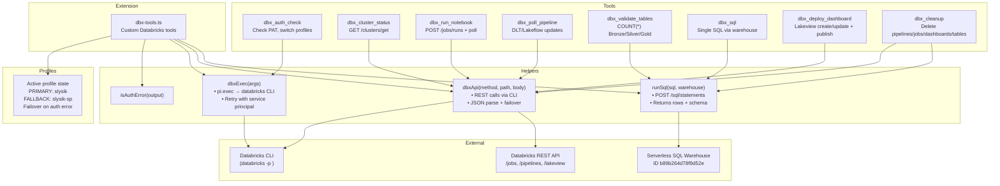

# dbx-tools.ts Overview

## How to Read This Diagram
- **Extension**: Registers all tools when pi loads the `dbx-tools.ts` extension.
- **Profiles**: Maintains a sticky active profile, failing over from the PAT profile (`slysik`) to the service principal (`slysik-sp`) whenever authentication errors appear.
- **Helpers**: Shared utility functions used by every tool to issue Databricks CLI/REST calls with automatic retry and JSON parsing.
- **Tools**: The eight exported pi tools, each mapped to the helper(s) and APIs they rely on.
- **External**: Databricks systems the extension talks to: CLI auth, REST APIs, and the default SQL warehouse.

Use this as a quick reference when extending or debugging the extension—start at the helper layer to trace how each tool dispatches work to the Databricks platform.
