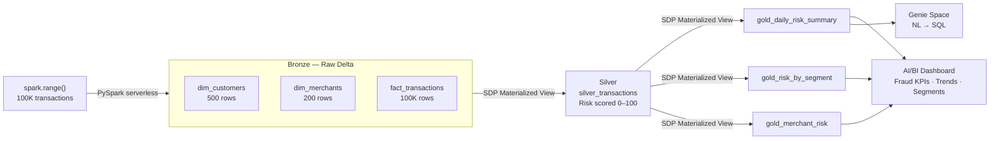

# Finance Lakehouse — Transaction Risk Platform

**Catalog:** `workspace` | **Schema:** `finance` | **Compute:** Serverless (AWS)

> **SA Interview Demo** — 60-minute live build simulating a customer PoC.
> Scenario: Real-Time Transaction Risk & Fraud Detection for a regional bank.

## Architecture



## Layers

| Layer | Tables | Rows | Method |
|---|---|---|---|
| Bronze | `dim_customers`, `dim_merchants`, `fact_transactions` | 500 / 200 / 100K | `spark.range()` → Delta |
| Silver | `silver_transactions` | ~100K | SDP Materialized View |
| Gold | `gold_daily_risk_summary`, `gold_risk_by_segment`, `gold_merchant_risk` | ~365 / ~60 / ~200 | SDP Materialized View |

## Run

```bash
# 1. Upload to workspace
just upload-project finance_lakehouse

# 2. Open in workspace browser
just open

# 3. Run Bronze notebook (serverless compute — no cluster needed)
# Workspace → finance_lakehouse/notebooks/01_generate_bronze → Run All

# 4. Start SDP pipeline (auto-created by bundle deploy)
# Pipelines → finance_medallion → Start

# 5. Validate
just sql "SELECT table_name, COUNT(*) FROM workspace.finance.silver_transactions GROUP BY table_name"

# 6. Open dashboard (after pipeline completes)
```

## File Structure

```
finance_lakehouse/
├── databricks.yml                  Asset Bundle — pipeline + job (serverless)
├── README.md
├── src/
│   ├── notebooks/
│   │   └── 01_generate_bronze.py   PySpark — dims + fact + broadcast join → Bronze Delta
│   └── pipeline/
│       ├── 02_silver_transforms.sql  SDP MV — enriched + risk scored transactions
│       ├── 03_gold_aggregations.sql  SDP MV — 3 Gold views for dashboard
│       └── 04_validate.sql           Row counts + dedup check + health queries
├── docs/
│   ├── architecture.md             Mermaid + design decisions + risk scoring logic
│   └── demo_narrative.md           60-min SA demo script + objection handling
└── tests/
    └── README.md
```

## Scenario Adaptation (4-Hour Build Window)

The prompt arrives 4 hours before the interview. This scaffold covers:

| If prompt mentions | Story to tell | Column to highlight |
|---|---|---|
| Fraud / AML | T+24h batch → near-real-time detection | `risk_score`, `rules_engine_flag` |
| Credit risk | Delinquency rate, portfolio concentration | `customer_risk_tier`, `amount` |
| Regulatory reporting | T+5 days → T+1, Basel IV compliance | `mcc_code`, `customer_country` |
| Customer 360 | Unified view, churn prevention | `customer_segment`, `member_since_days` |

**Code stays the same. Only the narrative changes.**
