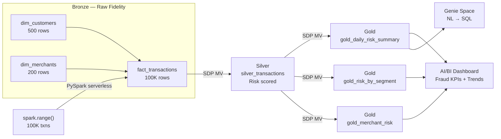

# Architecture — Finance Lakehouse: Transaction Risk Platform

## Medallion Flow



## Design Decisions

| Decision | Choice | Why |
|---|---|---|
| Data generation | `spark.range()` | Distributed — no driver pressure at any scale |
| Dim joins | Broadcast | Dims are tiny (200–500 rows) — zero shuffle |
| Silver transform | Materialized View | Declarative SQL, auto-refresh, no ETL code to maintain |
| Risk scoring | Deterministic CASE/CRC32 | Reproducible — same score every refresh, no RAND() in MVs |
| Compute | Serverless | No cluster management, instant scale, pay-per-query |
| Governance | Unity Catalog `workspace` catalog | Fine-grained access, column masks for PII, full lineage |

## Risk Scoring Logic

```
customer_risk_tier = HIGH  + merchant_is_high_risk + amount > $1000  →  92
customer_risk_tier = HIGH  + merchant_is_high_risk                   →  78
customer_risk_tier = HIGH  + amount > $5000                          →  72
customer_risk_tier = MEDIUM + merchant_is_high_risk + amount > $500  →  65
customer_risk_tier = HIGH  + amount > $1000                          →  58
amount > $8000                                                        →  55
customer_risk_tier = HIGH                                             →  45
merchant_is_high_risk = true                                          →  38
customer_risk_tier = MEDIUM + amount > $2000                         →  30
customer_risk_tier = MEDIUM                                           →  22
LOW baseline (deterministic hash)                                     →   5–20

risk_bucket: HIGH ≥ 70 | MEDIUM 40–69 | LOW < 40
```

## Scaling

| Scale | N_EVENTS | Bronze Time | SDP Time |
|---|---|---|---|
| Dev | 1,000 | < 5s | ~40s (serverless startup) |
| Demo | 100,000 | ~30s | ~50s |
| Prod | 10,000,000 | ~5 min | ~2 min |

**Zero code changes between scales.** Change one parameter: `N_EVENTS`.

## What I'd Add in Production

- **Auto Loader** ingesting from S3/ADLS for real event streams
- **Structured Streaming** on `bronze_fact_transactions` for near-real-time Silver
- **ML Model** (MLflow + Feature Store) replacing CASE-based scoring
- **Column Masks** on `customer_id` for PII (analyst sees masked ID, risk sees full)
- **Row Filters** on `customer_country` for GDPR data residency enforcement
- **GitHub Actions CI/CD** — `bundle validate` + `bundle deploy` on every PR
- **SLA alerting** — Databricks Jobs notification on pipeline failure or SLA breach
