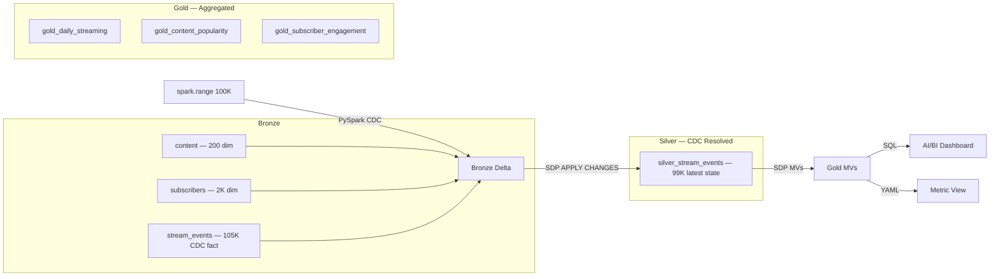

# Media Lakehouse — CDC Medallion Pipeline

**Catalog:** `interview` | **Schema:** `media` | **Cluster:** interview-cluster

## Architecture



## CDC Pattern

Bronze contains a CDC feed with `_change_type` (INSERT/UPDATE/DELETE) and `_commit_timestamp` columns.
Silver uses SDP `APPLY CHANGES` (AUTO CDC, SCD Type 1) to materialize the latest state per `event_id`.

| Operation | Count | Effect |
|-----------|-------|--------|
| INSERT | 100,000 | Base events |
| UPDATE | 4,000 | Corrected watch_minutes |
| DELETE | 1,000 | Removed events |
| **Silver** | **99,000** | **Latest state** |

## Layers

| Layer | Tables | Method |
|-------|--------|--------|
| Bronze | `bronze_content`, `bronze_subscribers`, `bronze_stream_events` | `spark.range()` → Delta |
| Silver | `silver_stream_events` | SDP `APPLY CHANGES` (SCD Type 1) |
| Gold | `gold_daily_streaming`, `gold_content_popularity`, `gold_subscriber_engagement` | SDP Materialized Views |
| Metric | `media_streaming_metrics` | YAML metric view on Silver + dim joins |

## Run

```bash
# 1. Deploy bundle
cd media_lakehouse && databricks bundle validate && databricks bundle deploy

# 2. Run Bronze notebook on cluster
# 3. Start SDP pipeline (full refresh)
# 4. Create metric view (SQL)
# 5. Open dashboard
```

## Project Structure

```
src/notebooks/   — PySpark Bronze generation with CDC columns
src/pipeline/    — SQL for SDP Silver (APPLY CHANGES) + Gold (MVs)
src/dashboard/   — AI/BI Dashboard JSON
docs/            — Architecture diagram and design decisions
tests/           — Test scaffolding
databricks.yml   — Asset Bundle config (pipeline + job)
```
