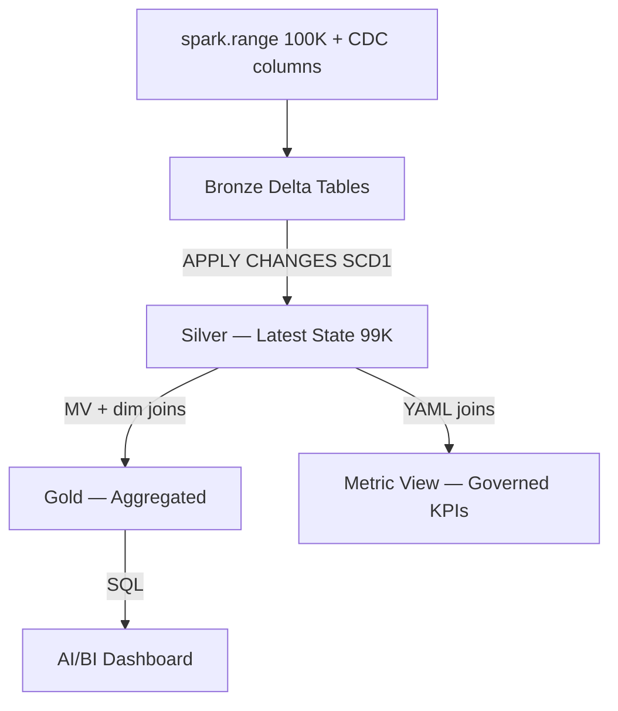
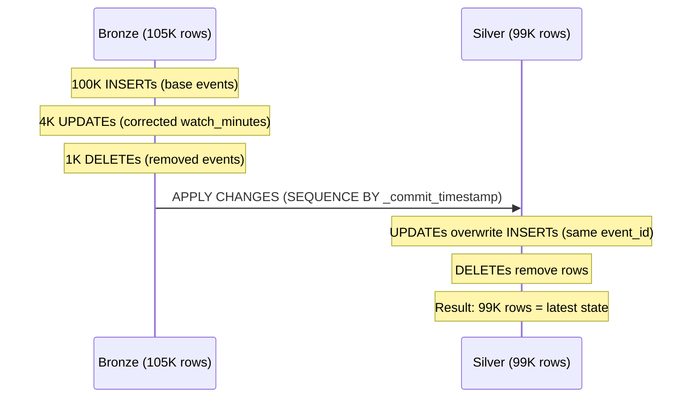

# Architecture — Media Lakehouse (CDC)

## Design Decisions

1. **spark.range() for data generation** — distributed, no driver pressure, scales linearly
2. **CDC at Bronze** — `_change_type` + `_commit_timestamp` columns simulate a real CDC feed (event corrections, late-arriving updates, cancellations)
3. **APPLY CHANGES at Silver** — SDP handles sequencing, dedup, and delete propagation automatically — no manual MERGE logic
4. **SCD Type 1** — latest state only (no history) — appropriate for streaming events where corrections replace originals
5. **Metric view with star-schema joins** — governed KPIs that join Silver fact with Bronze dims in YAML, consistent across all consumers
6. **Liquid clustering** — auto-optimized file layout on `event_ts` (Silver) and date dims (Gold)

## Medallion Flow

## CDC Flow Detail

## Scaling Strategy

| Scale | N_EVENTS | Bronze Rows | Silver Rows | Runtime |
|-------|----------|-------------|-------------|---------|
| Dev | 100 | 105 | 99 | < 5 sec |
| Demo | 100,000 | 105,000 | 99,000 | < 30 sec |
| Prod | 1,000,000+ | 1,050,000 | 990,000 | < 2 min |

Zero code changes — only `N_EVENTS` parameter changes.

## What I'd Add in Production

- [ ] Service principal for job ownership
- [ ] CI/CD with `bundle validate` + `bundle deploy` in GitHub Actions
- [ ] SDP `EXPECT` constraints on Silver (null checks, range validation)
- [ ] SCD Type 2 for subscriber dim (track plan changes over time)
- [ ] Monitoring: row count alerts, CDC lag tracking, SLA breach notifications
- [ ] Multi-environment targets: dev → staging → prod
- [ ] Streaming ingestion from Kafka/Event Hubs for real-time CDC
