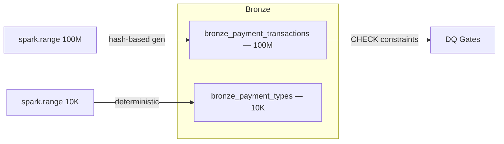

# Payments Lakehouse — Bronze Generation

**Catalog:** `interview` | **Schema:** `payments` | **Cluster:** interview-cluster

## Architecture



## Tables

| Table | Rows | Type | Key Features |
|-------|------|------|-------------|
| `bronze_payment_types` | 10,000 | Dim | 6 cols, hash-distributed categories |
| `bronze_payment_transactions` | 100,000,000 | Fact | Liquid clustering on `transaction_ts`, CHECK constraints |

## Features Demonstrated

- `spark.range()` at 100M scale — single-param scaling
- Hash-based deterministic data generation (`F.hash()` + modular arithmetic)
- Weighted distributions (status, currency) via hash buckets
- Liquid clustering (auto-optimized, no partition skew)
- Unity Catalog 3-level namespace
- Bronze metadata columns (`ingest_ts`, `source_system`, `batch_id`)
- CHECK constraints (shift-left DQ at ingestion)

## Run

```bash
# Upload and run Bronze notebook on cluster
just nb-upload payments_lakehouse/src/notebooks/01_generate_bronze.py /Users/slysik@gmail.com/payments_lakehouse/01_generate_bronze
```

## Project Structure

```
src/notebooks/   — PySpark Bronze generation (100M fact + 10K dim)
docs/            — Architecture diagram and design decisions
tests/           — Test scaffolding
databricks.yml   — Asset Bundle config
```
