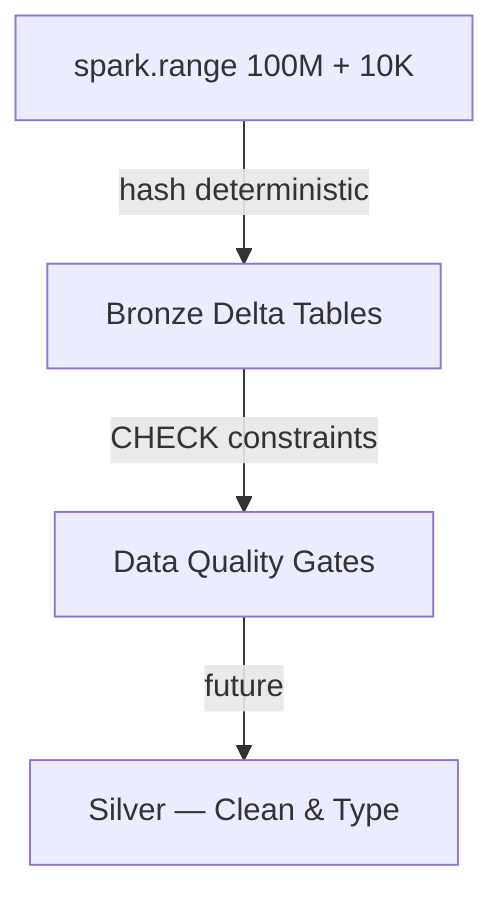

# Architecture — Payments Lakehouse (Bronze)

## Design Decisions

1. **`spark.range(100M)` for data generation** — distributed, no driver pressure, scales linearly
2. **Hash-based deterministic generation** — `F.hash()` + modular arithmetic, reproducible datasets
3. **No `F.rand()`** — hash is fully deterministic (same id = same output every run)
4. **Direct to Bronze Delta** — no intermediate parquet/Volume hop
5. **Liquid clustering on `transaction_ts`** — auto-optimized, no skew risk on high-cardinality timestamps
6. **CHECK constraints at Bronze** — shift-left DQ, catch bad data at ingestion not downstream
7. **Optimized write (platform default)** — no manual `repartition()`, let AQE handle file sizing

## Hash-Based Generation Pattern

```
F.abs(F.hash(F.col("id"), F.lit("salt")).cast("bigint")) % N
```

- `F.hash()` → deterministic INT from any input
- `.cast("bigint")` → avoid INT overflow on `abs(Integer.MIN_VALUE)`
- `F.lit("salt")` → different hash per column (same id → different values)
- `% N` → map to category bucket

**Weighted distributions** via hash buckets:
```
hash % 100 < 70  → COMPLETED (70%)
hash % 100 < 85  → PENDING   (15%)
hash % 100 < 95  → FAILED    (10%)
hash % 100 >= 95 → REVERSED  (5%)
```

## Medallion Flow



## Scaling Strategy

| Scale | N_EVENTS | Expected Runtime (4-core) |
|-------|----------|--------------------------|
| Dev | 100 | < 5 sec |
| Demo | 100,000 | < 30 sec |
| Scale | 10,000,000 | ~5 min |
| Full | 100,000,000 | ~20-30 min |

Zero code changes between scales — only `N_EVENTS` parameter changes.

## What I'd Add in Production

- [ ] Silver/Gold layers via SDP (Materialized Views)
- [ ] Service principal for job ownership
- [ ] CI/CD with `bundle validate` + `bundle deploy` in GitHub Actions
- [ ] Data quality expectations on Silver (SDP `EXPECT` constraints)
- [ ] Monitoring: row count alerts, SLA breach notifications
- [ ] Unit tests with chispa for transform functions
