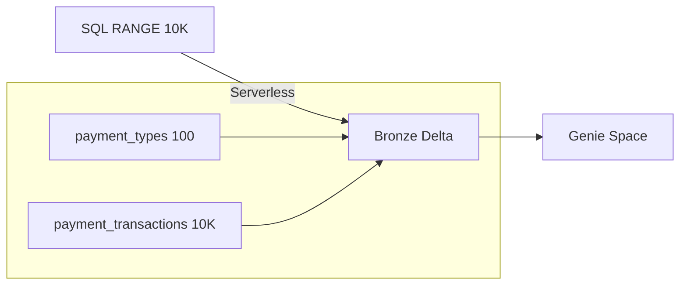

# Payments Lakehouse — Bronze Generation (2026-03-12 Rerun)

**Catalog:** `interview` | **Schema:** `payments_0312` | **Compute:** Serverless SQL
**Scale:** 10K transactions + 100 payment types

## Architecture



## Run
```bash
# All Bronze via serverless SQL — no cluster needed
# Genie Space via data-rooms API
```
