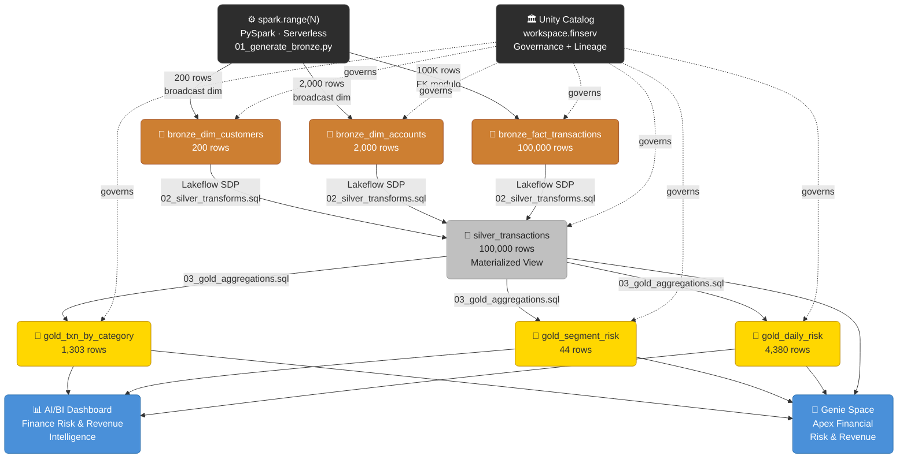

# Apex Financial Services — FinServ Lakehouse

> **Databricks SA Demo** · Full medallion lakehouse + AI/BI · Built end-to-end in ~6 minutes on serverless compute

[](https://databricks.com)
[](https://docs.databricks.com/data-governance/unity-catalog/)
[](https://delta.io)
[](https://docs.databricks.com/workflows/delta-live-tables/)

---

## Architecture

```
╔══════════════════════════════════════════════════════════════════════════════╗
║                     APEX FINANCIAL — LAKEHOUSE ARCHITECTURE                  ║
╠══════════════════════════════════════════════════════════════════════════════╣
║                                                                              ║
║   ┌─────────────────────────────────────────────────────────────────────┐   ║
║   │                    DATA GENERATION (PySpark Serverless)             │   ║
║   │   spark.range(N)  ──►  No Faker · No Pandas · No Python loops      │   ║
║   └──────────────────────────┬──────────────────────────────────────────┘   ║
║                               │                                              ║
║   ┌───────────────────────────▼──────────────────────────────────────────┐  ║
║   │  🥉 BRONZE  (Append-only · Raw fidelity · Delta · ingest_ts)        │  ║
║   │                                                                      │  ║
║   │  ┌──────────────────┐  ┌──────────────────┐  ┌──────────────────┐   │  ║
║   │  │ dim_customers    │  │ dim_accounts     │  │ fact_transactions │   │  ║
║   │  │    200 rows      │  │   2,000 rows     │  │   100,000 rows   │   │  ║
║   │  │  broadcast dim   │  │  broadcast dim   │  │  spark.range FK  │   │  ║
║   │  └──────────────────┘  └──────────────────┘  └────────┬─────────┘   │  ║
║   └─────────────────────────────────────────────────────────┼────────────┘  ║
║                               │ Lakeflow Spark Declarative Pipelines         ║
║   ┌───────────────────────────▼──────────────────────────────────────────┐  ║
║   │  🥈 SILVER  (Typed · Deduped · Null-handled · Explicit schema)      │  ║
║   │                                                                      │  ║
║   │  ┌────────────────────────────────────────────────────────────────┐  │  ║
║   │  │  silver_transactions  ·  100,000 rows  ·  Materialized View   │  │  ║
║   │  │  joins: fact ⋈ dim_accounts ⋈ dim_customers                  │  │  ║
║   │  │  adds:  customer_segment · account_type · merchant_category   │  │  ║
║   │  └────────────────────────────────────────────────────────────────┘  │  ║
║   └──────────────────────────────┬───────────────────────────────────────┘  ║
║                                  │ SDP Materialized Views                    ║
║   ┌──────────────────────────────▼───────────────────────────────────────┐  ║
║   │  🥇 GOLD  (Pre-aggregated · BI-ready · Stable contract)             │  ║
║   │                                                                      │  ║
║   │  ┌────────────────────┐  ┌────────────────────┐  ┌───────────────┐  │  ║
║   │  │ txn_by_category    │  │  segment_risk      │  │ daily_risk    │  │  ║
║   │  │  1,303 rows        │  │    44 rows         │  │  4,380 rows   │  │  ║
║   │  │  revenue + risk    │  │  avg risk score    │  │  daily trends │  │  ║
║   │  │  by merchant cat   │  │  by segment        │  │  + anomalies  │  │  ║
║   │  └────────┬───────────┘  └─────────┬──────────┘  └──────┬────────┘  │  ║
║   └───────────┼──────────────────────── ┼────────────────────┼───────────┘  ║
║               │                         │                    │               ║
║   ┌───────────▼─────────────────────────▼────────────────────▼───────────┐  ║
║   │                        AI / BI CONSUMPTION                           │  ║
║   │                                                                      │  ║
║   │   ┌──────────────────────────────┐   ┌───────────────────────────┐  │  ║
║   │   │  📊 AI/BI Dashboard          │   │  🤖 Genie Space           │  │  ║
║   │   │  Finance Risk & Revenue      │   │  Apex Financial           │  │  ║
║   │   │  Intelligence                │   │  Risk & Revenue           │  │  ║
║   │   │                              │   │  Intelligence             │  │  ║
║   │   │  · KPI scorecards            │   │                           │  │  ║
║   │   │  · Category breakdown        │   │  · Natural language SQL   │  │  ║
║   │   │  · Segment risk heatmap      │   │  · 8 sample questions     │  │  ║
║   │   │  · Daily trend lines         │   │  · Live FM inference      │  │  ║
║   │   │  · Fraud rate gauge          │   │  · 4 UC tables connected  │  │  ║
║   │   └──────────────────────────────┘   └───────────────────────────┘  │  ║
║   └──────────────────────────────────────────────────────────────────────┘  ║
║                                                                              ║
║   ━━━━━━━━━━━━━━━━━━━━━━━━━━━━━━━━━━━━━━━━━━━━━━━━━━━━━━━━━━━━━━━━━━━━━━  ║
║   🏛  UNITY CATALOG  ·  workspace.finserv  ·  All tables governed + lineage  ║
║   ⚡  SERVERLESS COMPUTE  ·  Notebooks + SDP pipelines · Zero cluster mgmt   ║
║   📦  ASSET BUNDLE  ·  databricks.yml  ·  One-command deploy (CI/CD ready)   ║
╚══════════════════════════════════════════════════════════════════════════════╝
```

---

## Mermaid Flow Diagram



---

## Data at a Glance

| Layer | Table | Rows | Method |
|---|---|---|---|
| 🥉 Bronze | `bronze_dim_customers` | 200 | `spark.range()` → broadcast dim |
| 🥉 Bronze | `bronze_dim_accounts` | 2,000 | `spark.range()` → broadcast dim |
| 🥉 Bronze | `bronze_fact_transactions` | **100,000** | `spark.range()` → FK modulo |
| 🥈 Silver | `silver_transactions` | **100,000** | SDP Materialized View · 3-way join |
| 🥇 Gold | `gold_txn_by_category` | 1,303 | SDP MV · revenue + risk by category |
| 🥇 Gold | `gold_segment_risk` | 44 | SDP MV · risk profile by segment |
| 🥇 Gold | `gold_daily_risk` | 4,380 | SDP MV · daily trends + anomalies |

**Total rows:** 207,927 · **Revenue (reconciled):** $166,991,362.86 across all three layers ✅

---

## AI Assets

### 📊 AI/BI Dashboard — Finance Risk & Revenue Intelligence
> **ID:** `01f123059a321a288cbedf386dba1076`  
> **URL:** https://dbc-ad74b11b-230d.cloud.databricks.com/dashboards/01f123059a321a288cbedf386dba1076?o=1562063418817826

| Widget | Description |
|---|---|
| KPI Scorecards | Total revenue · Transaction count · High-risk count · Risk rate % |
| Revenue by Category | Bar chart — Retail leads at $50M |
| Segment Risk Heatmap | Risk score × high-risk count by customer segment |
| Daily Volume Trend | Line chart — transaction count + revenue over time |
| Fraud Rate Gauge | % high-risk transactions vs threshold |

### 🤖 Genie Space — Apex Financial Risk & Revenue Intelligence
> **ID:** `01f123083e551b77b5eaa2959201f257`  
> **URL:** https://dbc-ad74b11b-230d.cloud.databricks.com/genie/rooms/01f123083e551b77b5eaa2959201f257?o=1562063418817826

**Tables connected:** `silver_transactions` · `gold_txn_by_category` · `gold_segment_risk` · `gold_daily_risk`

**Sample questions loaded:**
1. What are the top 5 transaction categories by total revenue?
2. Which customer segments have the highest average risk score?
3. What is the daily transaction volume and revenue trend over the last 30 days?
4. How many transactions were flagged as high risk, and what percentage is that?
5. What is the total revenue across all transaction categories?
6. Which categories have the highest ratio of declined transactions?
7. Show me revenue and risk metrics broken down by customer segment
8. Which day had the most high-risk transactions?

**Live test result (2026-03-18):**
> **Q:** What is the total revenue and how many transactions were high risk?  
> **A:** Total revenue is **$166,991,362.86** · **3,853 high-risk transactions** flagged.

---

## Build Metrics (2026-03-18)

| Phase | Time | Notes |
|---|---|---|
| Phase 1 — Clean Slate | 8s | dbx_cleanup + DROP SCHEMA + verify |
| Phase 2 — Bundle Deploy | 22s | validate + deploy + upload to Git |
| Phase 3 — Bronze Gen | 1m 15s | 100K rows · spark.range() · serverless |
| Phase 4 — SDP Pipeline | 47s | Silver MV + 3 Gold MVs · serverless |
| Phase 5 — Validate | 12s | Row counts + revenue reconciliation |
| Phase 6 — Dashboard | 6s | POST + publish lakeview |
| Phase 7 — Genie Space | 18s | Create + tables + sample questions |
| **Total** | **~6 min** | Full stack · zero manual steps |

---

## Databricks Features Demonstrated

| Feature | Where Used | Why It Matters |
|---|---|---|
| **spark.range()** | Bronze generation | Scalable synthetic data — 100 → 1M by changing one param |
| **Broadcast join** | Bronze dim lookup | Eliminates shuffle for small dims — AQE aware |
| **Lakeflow SDP** | Silver + Gold | Zero-code pipeline — SQL-only, serverless, auto-managed |
| **Materialized Views** | Silver + Gold | Declarative transforms — incremental by default |
| **Delta Lake** | All layers | ACID, time travel, Z-order, liquid clustering ready |
| **Unity Catalog** | workspace.finserv | 3-level namespace · lineage · governance · fine-grained ACL |
| **Serverless Compute** | Notebooks + SDP | No cluster management · instant start · pay-per-query |
| **Asset Bundles** | databricks.yml | CI/CD-ready IaC — one command deploy |
| **AI/BI Dashboard** | Lakeview | Business-user BI on top of UC-governed gold tables |
| **Genie Space** | NL SQL | Business users ask questions in plain English |

---

## Project Structure

```
finserv_lakehouse/
├── databricks.yml                    # Asset Bundle (pipeline + job)
├── README.md                         # This file
│
├── src/
│   ├── notebooks/
│   │   └── 01_generate_bronze.py     # PySpark · spark.range() · Bronze Delta
│   ├── pipeline/
│   │   ├── 02_silver_transforms.sql  # SDP · Silver Materialized View
│   │   ├── 03_gold_aggregations.sql  # SDP · 3 Gold Materialized Views
│   │   └── 04_validate.sql           # Row counts + revenue reconciliation
│   ├── dashboard/
│   │   └── dashboard.json            # AI/BI Dashboard (Lakeview format)
│   └── genie/
│       └── genie_space.json          # Genie Space config + rebuild instructions
│
├── docs/
│   ├── architecture.md               # Deep-dive architecture notes
│   ├── BUILD_METRICS.md              # Latest build metrics report
│   ├── BUILD_REPORT.md               # Build summary
│   ├── metrics/
│   │   └── 2026-03-18.json           # Machine-readable build metrics
│   └── demo_flows/
│       ├── MASTER_DEMO_GUIDE.md      # Full demo script
│       ├── persona_01_data_engineer.md
│       ├── persona_02_risk_analyst.md
│       └── persona_03_executive.md
│
└── scripts/
    └── generate_build_metrics.py     # Post-build metrics reporter
```

---

## Quick Deploy

```bash
# 0. Pre-flight
just preflight

# 1. Clean slate
dbx_cleanup catalog=workspace schema=finserv
databricks -p slysik-aws api post ... # DROP SCHEMA IF EXISTS workspace.finserv CASCADE

# 2. Deploy bundle
cd finserv_lakehouse
databricks -p slysik-aws bundle validate && databricks -p slysik-aws bundle deploy

# 3. Generate Bronze (serverless)
databricks -p slysik-aws api post "/api/2.1/jobs/runs/submit" \
  --json '{"queue":{"enabled":true},"tasks":[{"task_key":"bronze","notebook_task":{"notebook_path":"/Workspace/Users/slysik@gmail.com/dbx-sa-build-demo-pitch/finserv_lakehouse/notebooks/01_generate_bronze"}}]}'

# 4. Run SDP pipeline
databricks -p slysik-aws pipelines start-update <pipeline_id> --full-refresh

# 5. Generate metrics report
just metrics finserv_lakehouse <pipeline_id> <run_id> <dashboard_id> <genie_id>
```

---

## Demo Personas

| Persona | Entry Point | Key Talking Points |
|---|---|---|
| 🔧 **Data Engineer** | Bronze notebook → Pipeline UI | "How we build zero-ETL pipelines that scale from 100K to 100M rows by changing one parameter — and deploy with a single `bundle deploy` command." |
| 📊 **Risk Analyst** | Dashboard → Genie | "Real-time risk rate across 100K transactions. Ask questions in plain English — Genie generates the SQL and returns structured results instantly." |
| 💼 **Finance Executive** | Dashboard KPIs | "Total revenue $167M reconciled across bronze/silver/gold. Retail leads at $50M. Risk rate visible in one click — no SQL required." |

---

## Workspace Links

| Resource | URL |
|---|---|
| Git Folder | https://dbc-ad74b11b-230d.cloud.databricks.com/browse/folders/3401527313137932?o=1562063418817826 |
| SDP Pipeline | https://dbc-ad74b11b-230d.cloud.databricks.com/pipelines/05ba7758-cf42-4a2f-9033-7a301b09c3f8?o=1562063418817826 |
| AI/BI Dashboard | https://dbc-ad74b11b-230d.cloud.databricks.com/dashboards/01f123059a321a288cbedf386dba1076?o=1562063418817826 |
| Genie Space | https://dbc-ad74b11b-230d.cloud.databricks.com/genie/rooms/01f123083e551b77b5eaa2959201f257?o=1562063418817826 |
| GitHub | https://github.com/slysik/dbx-sa-build-demo-pitch |

---

*Built with Databricks Asset Bundles · Lakeflow SDP · Unity Catalog · AI/BI · Serverless*
