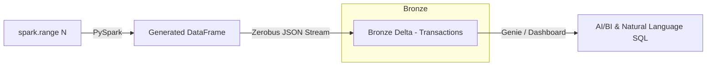

# Finserv Lakehouse — Medallion Pipeline & Zerobus Streaming

**Catalog:** `dbx_weg` | **Schema:** `finserv` | **Cluster:** interview-cluster

## Architecture



## Layers

| Layer | Tables | Method |
|-------|--------|--------|
| Bronze | `transactions` | `Zerobus Ingest API` |
| Serving | `Genie Space` | Conversational SQL |

## Run

```bash
# 1. Deploy bundle
databricks bundle validate && databricks bundle deploy

# 2. Run Bronze generation & Zerobus streaming locally or on cluster
# 3. Open Genie Space
```

## Project Structure

```
src/notebooks/   — PySpark data generation & Zerobus streaming script
docs/            — Architecture diagram and design decisions
tests/           — Test scaffolding
databricks.yml   — Asset Bundle config
```
