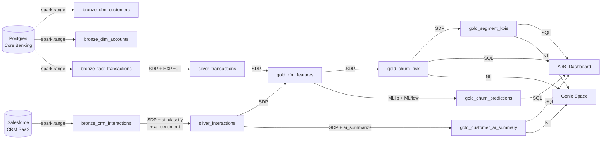

# Apex Banking — Customer 360 Intelligence Platform

> "The business is growing, but our ability to make smart, fast decisions isn't keeping pace."

This prototype answers that problem across four connected layers. Each layer feeds the next — this is one solution, not four demos stitched together.

---

## The Story

```
Customer calls in angry about ATM fees (CRM note)
    → AI classifies it as a complaint
    → Sentiment score turns negative
    → Churn model sees: 90 days dormant + 2 complaints + negative sentiment
    → Risk score: HIGH
    → Relationship manager gets an alert in the dashboard
    → Genie answers: "Which Premium customers are at risk this month and why?"
```

---

## Four Layers, One Thread

### Layer 1 — Governed Data Foundation
Two source systems, unified:
- **Core Banking System (Postgres)** → customers, accounts, 10K transactions
- **Salesforce CRM (SaaS export)** → 500 customer interaction notes

Unity Catalog enforces the single source of truth. Data quality constraints (EXPECT) are the contract. Delta history gives you full audit lineage.

### Layer 2 — Predictive ML
A churn risk model trained on the data we just ingested:
- **Features:** how recently did they transact? how often? how much? how many complaints?
- **Model:** Logistic Regression (Spark MLlib), tracked in MLflow, registered in UC Model Registry
- **Output:** `gold_churn_predictions` — churn probability 0–1 per customer

Every pipeline refresh can trigger a retrain. Model versions are audited in the registry.

### Layer 3 — GenAI Activation
The "untapped asset" — years of customer interaction notes nobody could use:
- `ai_classify` turns raw call notes into structured complaint/inquiry/escalation/praise labels
- `ai_analyze_sentiment` scores how customers feel across every interaction
- `ai_summarize` synthesizes a customer's full history into one readable insight for relationship managers

These run **inside the data pipeline** — no separate AI infrastructure.

### Layer 4 — Business Presentation
- **AI/BI Dashboard:** Where is churn risk concentrated? Which segments drive revenue? Who are the specific at-risk customers and what did AI say about them?
- **Genie Space:** Business leaders ask questions in plain English — "What's our churn exposure in the Northeast?" — and get answers backed by live Gold data.

---

## Architecture



---

## Tables

| Table | Layer | Rows | Description |
|---|---|---|---|
| `bronze_dim_customers` | Bronze | 200 | Customer profile — segment, region, risk tier |
| `bronze_dim_accounts` | Bronze | 500 | Account master — type, branch, status |
| `bronze_fact_transactions` | Bronze | 10,000 | Transaction ledger from core banking |
| `bronze_crm_interactions` | Bronze | 500 | Raw CRM interaction notes from Salesforce |
| `silver_transactions` | Silver | ~10,000 | Cleaned, typed, validated transactions |
| `silver_interactions` | Silver | ~500 | CRM notes + AI classification + sentiment |
| `gold_rfm_features` | Gold | 200 | Per-customer RFM + behavioral features |
| `gold_churn_risk` | Gold | 200 | Churn score + tier (pipeline-based scoring) |
| `gold_customer_ai_summary` | Gold | ~150 | AI-generated interaction summary per customer |
| `gold_segment_kpis` | Gold | ~25 | Segment × region aggregates for BI |
| `gold_churn_predictions` | Gold | 200 | ML model churn probability (MLflow model) |

---

## Run

```bash
# Deploy pipeline + job
cd finserv_lakehouse
databricks bundle validate && databricks bundle deploy

# Run the full end-to-end story
databricks bundle run banking_orchestrator

# Or step by step
databricks bundle run banking_orchestrator --task generate_bronze
databricks bundle run banking_orchestrator --task run_pipeline
databricks bundle run banking_orchestrator --task train_churn_model
```

---

## Production Path (narrate, don't build live)

| What we built | What you'd add |
|---|---|
| `spark.range()` synthetic data | Auto Loader reading from S3/ADLS with schema evolution |
| Rule-based churn scoring in pipeline | ML model served as SQL UDF via Model Serving |
| Batch ai_summarize in Gold | Streaming summaries via Zerobus / Delta Live Tables |
| Single environment | dev → staging → prod via bundle targets + GitHub Actions |
| SP auth | Service principal with fine-grained UC grants per role |
