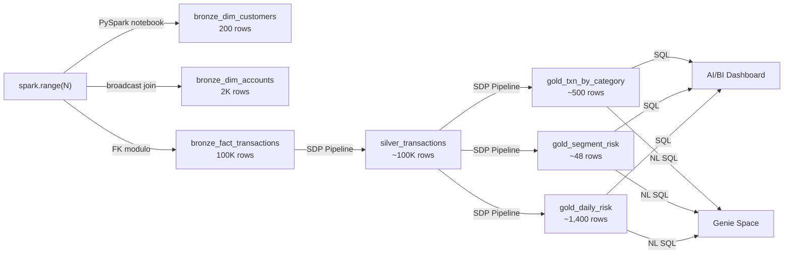

# Apex Financial Services — FinServ Lakehouse

**Catalog:** `workspace` | **Schema:** `finserv` | **Compute:** Serverless

## Architecture



## Medallion Layers

| Layer | Tables | Rows | Method |
|-------|--------|------|--------|
| Bronze | `bronze_dim_customers`, `bronze_dim_accounts`, `bronze_fact_transactions` | 200 / 2K / 100K | `spark.range()` → Delta |
| Silver | `silver_transactions` | ~100K | SDP Materialized View |
| Gold | `gold_txn_by_category`, `gold_segment_risk`, `gold_daily_risk` | ~500 / ~48 / ~1,400 | SDP Materialized View |

## Run

```bash
# 1. Deploy bundle (creates pipeline + job in workspace)
cd finserv_lakehouse
databricks bundle validate && databricks bundle deploy

# 2. Run Bronze notebook (serverless)
# → workspace: /Users/slysik@gmail.com/finserv_lakehouse/01_generate_bronze

# 3. Start SDP pipeline (full refresh)
# → Pipelines UI: finance_medallion

# 4. Open dashboard
# → Dashboards UI: Finance Risk & Revenue Intelligence
```

## Personas

| Persona | Entry Point | Key Story |
|---------|------------|-----------|
| 🔧 Data Engineer | Bronze notebook → Pipeline UI | "How we build zero-code pipelines that scale" |
| 📊 Risk Analyst | Dashboard (Risk tab) → Genie | "Real-time risk rate and flagged transaction analysis" |
| 💼 Finance Executive | Dashboard (Revenue tab) | "Merchant category P&L and customer segment performance" |

## Project Structure

```
src/notebooks/    ← PySpark Bronze generation
src/pipeline/     ← SQL Silver/Gold (SDP)
src/dashboard/    ← AI/BI Dashboard JSON
docs/demo_flows/  ← Persona-based demo scripts
databricks.yml    ← Asset Bundle (pipeline + job)
```
