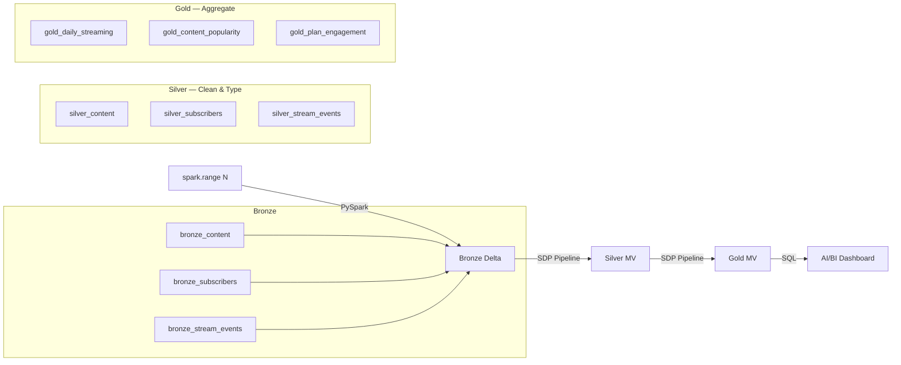

# Media Lakehouse — Medallion Pipeline

**Catalog:** `interview` | **Schema:** `media` | **Cluster:** interview-cluster

## Architecture



## Layers

| Layer | Tables | Method |
|-------|--------|--------|
| Bronze | `bronze_content`, `bronze_subscribers`, `bronze_stream_events` | `spark.range()` → Delta |
| Silver | `silver_content`, `silver_subscribers`, `silver_stream_events` | SDP Materialized View |
| Gold | `gold_daily_streaming`, `gold_content_popularity`, `gold_plan_engagement` | SDP Materialized View |

## Run

```bash
# 1. Deploy bundle
cd media_lakehouse && databricks bundle validate && databricks bundle deploy

# 2. Run Bronze notebook on cluster
# 3. Start SDP pipeline (full refresh)
# 4. Open dashboard
```

## Project Structure

```
src/notebooks/   — PySpark Bronze generation (full inline code)
src/pipeline/    — SQL for SDP Silver/Gold (raw SQL, no notebook headers)
src/dashboard/   — Dashboard JSON definition
docs/            — Architecture diagram and design decisions
tests/           — Test scaffolding
databricks.yml   — Asset Bundle config (pipeline + job)
```
