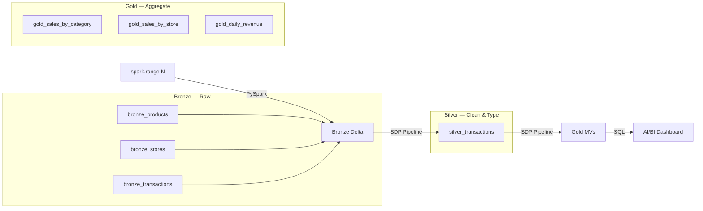

# Retail Lakehouse — Medallion Pipeline

**Catalog:** `workspace` | **Schema:** `retail` | **Compute:** Serverless

## Architecture



## Layers

| Layer | Tables | Method |
|-------|--------|--------|
| Bronze | `bronze_products`, `bronze_stores`, `bronze_transactions` | `spark.range()` → Delta |
| Silver | `silver_transactions` | SDP Materialized View |
| Gold | `gold_sales_by_category`, `gold_sales_by_store`, `gold_daily_revenue` | SDP Materialized Views |

## Run

```bash
# 1. Deploy bundle
cd retail_lakehouse
databricks bundle validate && databricks bundle deploy

# 2. Run Bronze notebook (serverless)
# 3. Start SDP pipeline (full refresh)
# 4. Open dashboard
```

## Project Structure

```
src/notebooks/   — PySpark Bronze generation
src/pipeline/    — SQL for SDP Silver/Gold (raw SQL, file: references)
src/dashboard/   — AI/BI Dashboard JSON
docs/            — Architecture & design decisions
tests/           — Test scaffolding
databricks.yml   — Asset Bundle config (pipeline + job)
```
