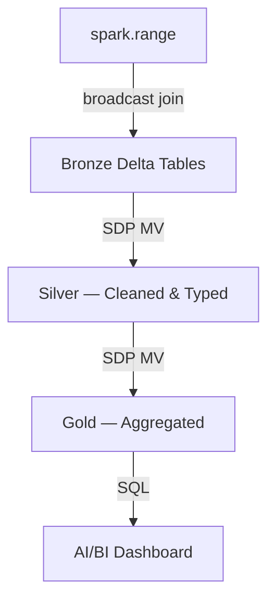

# Architecture — Retail Lakehouse

## Design Decisions

1. **spark.range() for data generation** — distributed, no driver pressure, scales linearly
2. **Direct to Bronze Delta** — no intermediate parquet/Volume hop
3. **Broadcast join dims into fact** — dims are tiny (200 products, 50 stores), zero shuffle
4. **SDP for Silver/Gold** — declarative SQL, managed serverless compute, auto-optimization
5. **AI/BI Dashboard** — native Databricks BI, no external tool dependency

## Medallion Flow

## Scaling Strategy

| Scale | N_EVENTS | Expected Runtime |
|-------|----------|-----------------|
| Dev | 1,000 | < 5 sec |
| Demo | 100,000 | < 30 sec |
| Prod | 1,000,000+ | < 2 min |

Zero code changes between scales — only `N_EVENTS` parameter changes.

## What I'd Add in Production

- [ ] Service principal for job ownership (eliminates personal identity auth flakes)
- [ ] CI/CD with `bundle validate` + `bundle deploy` in GitHub Actions
- [ ] Data quality expectations on Silver (SDP `EXPECT` constraints)
- [ ] Monitoring: row count alerts, SLA breach notifications
- [ ] Multi-environment targets: dev → staging → prod
- [ ] Unit tests with chispa for transform functions
- [ ] Liquid clustering on Bronze fact table (cluster by txn_date, product_id)
